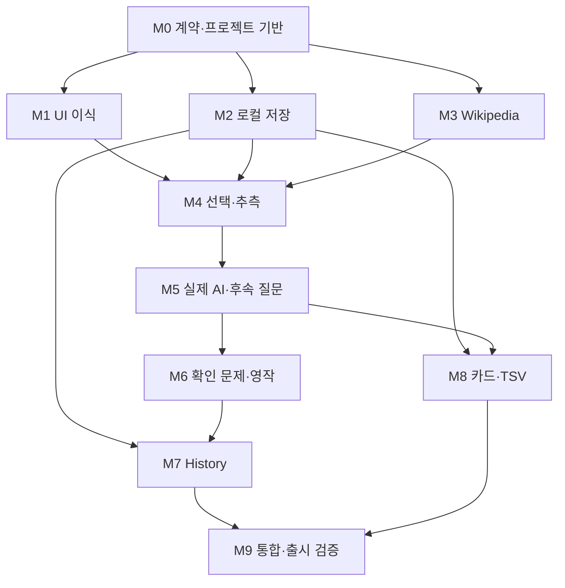

# Reading Room — 단계별 개발 계획

버전 1.0 · 2026-09-23 · 기준: PRD v1.1 / TECH_SPEC v1.0 / UI_SPEC v1.0

## 1. 개발 방식

한 단계의 구현·관련 테스트·결과 보고를 마친 뒤 다음 단계를 시작한다. 첫 지시문은 M0만 요청한다. 아래의 모든 단계를 한 번에 구현하라는 뜻이 아니다. 각 단계는 독립된 commit/PR로 검토할 수 있어야 한다.

- 화면 구조·스타일은 시제품을 재사용하고, 시연 로직은 제품 로직으로 간주하지 않는다.
- 인터페이스와 fixture를 먼저 정해 실제 외부 API 없이도 기능을 개발할 수 있게 한다.
- 외부 서비스가 필요한 단계만 실제 키·네트워크·Anki를 사용한다.
- mock 테스트 통과, 실제 연동 통과, 브라우저 시각 검증을 따로 기록한다.
- 관련 위험을 확인하는 테스트만 실행한다. 모든 변경마다 전체 외부 테스트를 반복하지 않는다.
- 단계가 막히면 완료로 표시하지 않고 막힌 의존성과 이미 검증한 범위를 기록한다.
- 기술 선택은 명세의 기본값을 사용한다. 배포 환경 때문에 변경해야 하면 이유·영향·대체 계약을 먼저 기록한다.

## 2. 기준 자료

| 파일 | 용도 |
| --- | --- |
| PRD.md | 사용자 가치·P0 범위·제품 완료 조건 P-01~15 |
| TECH_SPEC.md | 데이터·API·저장·export 계약 및 테스트 ID |
| UI_SPEC.md | CSS 실제 값·반응형·상태별 화면 |
| PROTOTYPE_SOURCE.zip | 배포 버전과 일치하는 화면 소스·실행 안내·해시 |

기준 시제품은 commit `128a19bb26e1c086d0dc81366e3597baaf726629`이다. 문서 4개가 이 시제품에서 실제 앱으로 진행하기 위한 기준선이다. 시제품 안의 개인 이름·고정 날짜·고정 답변을 운영 데이터로 초기화하지 않는다.

## 3. 의존성과 단계 산출물



의존성이 없는 모듈은 fixture로 독립 구현 가능하다는 의미이며, 여러 에이전트나 동시 개발을 자동 시작하라는 지시가 아니다. 기본 진행 순서는 M0 → M1 → … → M9다.

| 단계 | 외부 서비스 없이 검증할 수 있는 경계 | 실제 확인이 필요한 부분 |
| --- | --- | --- |
| M0 | 타입·스키마·샘플 | 배포 runtime 호환성 |
| M1 | 고정 데이터 UI | PC·태블릿 브라우저 |
| M2 | IndexedDB repository | 실제 브라우저 재시작·quota |
| M3 | HTML/JSON fixtures | 실제 Wikipedia 문서 |
| M4 | anchor·추측 상태 | 마우스·터치·IME |
| M5 | MockTutorAdapter·실패 응답 | 실제 AI API·키 보호·한도 |
| M6 | 저장된 quiz payload | AI 문제 품질 표본 |
| M7 | 저장 fixture·집계 | 실제 저장 기록과 화면 대조 |
| M8 | serializer·card 함수 | 실제 Anki Desktop import |
| M9 | 전체 자동 회귀 | 소유자 전용 사이트·최종 학습 |

## 4. M0 — 프로젝트 기반과 계약

**목표:** 기능을 분리해 구현할 수 있는 최소 구조를 마련한다.

범위:

1. 문서 4개·시제품 소스를 읽고 기술 기본값과 배포 환경을 확인한다.
2. React/TypeScript UI, Worker API, shared domain, Repository/TutorAdapter 인터페이스를 배치한다.
3. 실제 버전과 demo 모드를 구분하고 데모 store 이름을 분리한다.
4. TECH_SPEC의 타입·입출력 schema·에러 union과 테스트 fixture를 작성한다.
5. 모델/키는 환경 변수 예시의 이름만 기록한다. 비밀값을 commit하지 않는다.
6. Node·패키지 버전을 구현 시 확인해 lockfile에 고정하고 실행 방법을 README에 적는다.

**제외:** 실제 AI 호출, DB schema 전부 구현, 완성 UI, 배포 audience 변경.

**테스트:** schema의 유효/무효 요청 각 1개, mode 격리, import 경계, build/typecheck.

**완료:** 앱과 API entry가 실행되고 mock adapter를 교체할 수 있음. 모든 필수 계약이 명세와 일치. 관련 기준 P-15/T-EXTENSION의 구조 부분 완료.

**Codex 지시문**

> 문서 4개와 PROTOTYPE_SOURCE.zip을 읽고 M0만 구현해 줘. 모듈 경계·타입·검증 schema·mock 계약·실행 기반을 만들어 줘. 실제 AI 호출이나 다음 단계 기능은 시작하지 말고, 선택한 버전과 검증 결과를 보고해 줘.

## 5. M1 — UI 이식과 화면 이동

**목표:** 확정한 시각 규칙을 유지한 컴포넌트 UI를 만든다.

범위: AppShell, Home, Reading/Tutor, History, 표현·카드 dialog, hash 경로, 글자 크기, 데모 fixture 렌더링, 모든 모달/필터/전환 상태. Home 제목·URL 폼은 아직 mock resolve로 동작한다.

**입력 계약:** ViewModel fixtures. **출력:** 사용자 action callback. UI가 SDK/IndexedDB를 import하지 않아야 한다.

**테스트:** T-UI. 1440, 1366, 1024, 768, 390 폭과 900/901·650/651 경계. 선택 없이 빈 Tutor, 긴 인용, 긴 한국어, 200% 확대, dialog focus, 키보드 필터. 실제 브라우저 캡처를 남기고 OS/font를 기록한다.

**완료:** 사용자 요청 화면이 모두 연결되고 원문과 한국어 설명의 구분·규격이 맞음. 기능이 mock임을 표시. P-14의 UI 재현 부분 완료.

**제외:** 키 연결·영구 저장·Wikipedia 실제 조회.

**Codex 지시문**

> M1만 진행해 줘. 확정된 색상·본문·패널·반응형 수치를 유지해 시제품을 컴포넌트로 옮겨 줘. 화면 이동과 UI 상태는 fixture로 검증하고 실제 브라우저 캡처를 남겨 줘. 시연 데이터를 실데이터라고 표시하지 마.

## 6. M2 — IndexedDB 저장과 복원

**목표:** 모든 이후 기능이 사용할 신뢰할 수 있는 저장 계층을 만든다.

범위: schemaVersion=1, stores/indexes, Repository, migrations scaffold, revision 충돌, draft debounce/flush, 복합 transaction, 삭제 cascade, 모드별 DB 분리, 저장 상태 UI.

**입력/출력:** 도메인 객체만 사용. 실제 학습 내용 대신 fixtures로 round-trip 검증 가능.

**테스트:** T-STORE, T-FAILURE의 로컬 저장 항목. 정상 저장 후 재시작, transaction abort, quota, two-tab revision 충돌, 실패 migration에서 기존 데이터 보존, 응답을 메모리에 둔 재저장. 네트워크 fetch를 transaction 안에 넣지 않았는지 확인한다.

**완료:** 실제 브라우저에서 기록 복원. 실패 시 저장됨 표시가 없고 AI 재호출 없이 재저장 가능한 유스케이스. P-08, P-12의 저장 부분.

**제외:** 서버 학습 기록 DB·계정·동기화·백업 시스템.

**Codex 지시문**

> M2만 구현해 줘. Repository 계약으로 IndexedDB 저장·복원·트랜잭션·충돌을 다루고 실제 브라우저로 검증해 줘. 저장 실패를 sessionStorage fallback으로 숨기지 말아 줘.

## 7. M3 — Wikipedia 본문 가져오기

**목표:** 지정한 글을 재현 가능한 스냅샷으로 읽는다.

범위: 제목/허용 URL parser, 고정 host API, 제목·redirect·disambiguation, revision 고정 parse, HTML→ContentBlock, 출처·라이선스, 크기 제한, 실패 메시지, snapshot+session 저장.

**독립 개발:** API 응답 및 HTML fixtures로 parser와 resolve를 만들고 나중에 실제 adapter로 바꾼다.

**테스트:** T-WIKI. 실제 Himalayas 제목·URL 결과, 없는 제목, namespace 0 이외, 악성 host/port/encoded path, script/event handler, 목록·소제목, 빈 본문, 429·timeout·HTTP 200 error. 과거 스냅샷은 최신 조회 후에도 그대로 남아야 한다.

**완료:** 실제 Wikipedia 본문과 출처를 확인하고 저장한 버전으로 재시작 가능. P-01·02.

**제외:** 임의 웹 크롤러·이미지/표/수식 렌더링·요약 생성.

**Codex 지시문**

> M3만 구현해 줘. TECH_SPEC의 제목/URL 규칙과 revision 고정 과정을 따라 Wikipedia를 읽기 블록으로 변환해 줘. Himalayas를 실제로 조회해 첫 문단만이 아닌 본문이 들어오는지 확인하고 출처·생략 범위를 보존해 줘.

## 8. M4 — 원문 선택과 추측

**목표:** UI 선택을 원문 위치·질문·최초 추측으로 안정적으로 기록한다.

범위: UTF-16 spans, block 기반 anchor, 선택 메뉴 유형, 문단 대체 선택, 1,200자 선택/6,000자 문맥 제한, guess draft/unknown/submitted, 기존 질문 열기/새 질문 생성, 원문 위치 복원.

**독립 개발:** TutorAdapter는 mock. 추측 제출 전 호출 0회를 검증한다.

**테스트:** T-SELECT + T-AI gating. 텍스트 노드 경계, 여러 문단, 이모지, 같은 문장 두 번, 드래그 후 입력 focus, 터치, 한글 IME, 글자 크기 변경, 내부 페이지 왕복.

**완료:** 문맥이 틀리지 않고 최초 제출 추측이 보존됨. 단어 선택만으로 AI 요청이 생기지 않음. P-03·04.

**제외:** AI 설명 품질·대화 채점.

**Codex 지시문**

> M4만 구현해 줘. 텍스트 선택을 화면 좌표가 아닌 저장된 본문 anchor로 보존하고 추측 먼저 입력하는 흐름을 완성해 줘. 추측 전 AI 요청이 없는지 테스트로 보여 줘.

## 9. M5 — 실제 AI 설명과 후속 질문

**목표:** mock을 실제 API로 바꾸되 UI·저장 계약을 유지한다.

범위: Responses adapter, JSON Schema, runtime 검증, promptVersion, structured Explanation UI, 해당 항목의 제한된 후속 대화, request 원장, 서버 access guard/비밀키/상한, 수동 재시도·uncertain 상태.

**착수 조건:** 실제 키 사용 가능 여부를 확인한다. 키가 없으면 mock 계약까지만 구현하고 실제 검증은 미검증으로 남긴다. 채팅창에 키를 붙여 달라고 요청하지 않는다.

**테스트:** T-AI, T-SECURITY, 외부 관련 T-FAILURE. 거절·잘린 출력·잘못된 JSON·잘못된 evidence·timeout·429·미설정·이중 클릭·ID 중복. 비인증 요청 차단. 동시 요청 상한 및 일일 경계 검증. 로컬 저장 실패 때 동일 응답 재저장 확인.

**품질 표본:** Himalayas의 6개 표현에 정상 추측/오해 추측을 각각 적용한 12개 사례. 한국어 해석, 문법 설명, 피드백, 문맥 근거를 사람이 검토한다. 모든 호출을 매 CI에서 반복하지 않는다.

**완료:** 실제 설명과 후속 질문이 저장된 항목에 맞게 표시되고, 실패가 mock 답변으로 위장되지 않음. P-05·13 및 P-12 API 부분.

**제외:** 도구 실행, 검색 에이전트, streaming, 무제한 대화.

**Codex 지시문**

> M5만 진행해 줘. 공식 API 문서를 확인해 실제 AI 어댑터·구조화 응답·실패 처리·비공개 API·요청 상한을 구현해 줘. 응답 저장 실패와 결과 불명 상태를 구별하고, 실제 호출과 mock 테스트 결과를 따로 보고해 줘.

## 10. M6 — 이해도 문제·오답·영작

**목표:** 설명 이해에서 회상·사용으로 넘어간다.

범위: 문제 생성 API, 3개 option과 정답 ID 검증, 제출 전 답 숨김, Attempt append, unknown, 설명 참고 플래그, 문제 오류 제외, 명시적 새 시도, 항목별 Production.

**독립 개발:** 고정 quiz payload로 채점/기록부터 완성한 후 실제 생성 연결.

**테스트:** T-QUIZ. 첫 오답→재시도 정답에서 둘 다 보존. DOM/접근성 트리에 정답 사전 노출 없음. 서로 다른 item의 영작이 섞이지 않음. 옵션 중복/정답 부재 거절. 새로고침 후 문제를 재생성하지 않음.

**완료:** P-06·07. 객관식 채점과 자유 영작 저장의 의미를 구분. 실제 문제의 적절성을 품질 표본으로 확인.

**제외:** 자유문 자동 채점·대규모 문제은행·난이도 추천.

**Codex 지시문**

> M6만 구현해 줘. 확인 문제는 3지선다 한 개로 제한하고, 최초 결과와 재시도를 덮어쓰지 않게 해 줘. 영작은 학습 항목별로 저장하며 정확성을 자동 판정하지 마.

## 11. M7 — Home 집계와 Learning History

**목표:** 실제 저장 기록이 현재 화면을 구동하도록 전환한다.

범위: 실제 최근 세션·오늘 글·표현/질문 수, 날짜별 History 4개 필터·제목 검색, 펼침 상세, 기록→원문 anchor, 재시도 이동, 세션 종료·삭제.

**독립 개발:** 서로 다른 날짜·정답·오답·unknown·invalid quiz를 포함한 Repository fixture로 집계를 확인한다.

**테스트:** T-HISTORY. Asia/Seoul 자정 전후, demo 격리, 질문 실패 포함/초안 제외, 표현 1개 두 방향 카드, 첫 시도와 최신 시도 구분, 삭제 전 취소, 다른 세션 snapshot 보존.

**완료:** P-09. 실제 DB 레코드와 화면 수치가 일치. 고정된 시연 숫자 제거.

**Codex 지시문**

> M7만 진행해 줘. Home과 History를 실제 Repository selector로 연결하고 TECH_SPEC의 집계 정의를 그대로 사용해 줘. 실패한 질문·재시도·문제 오류·날짜 경계를 포함해 검증해 줘.

## 12. M8 — 표현·카드·TSV 내보내기

**목표:** 기억할 표현을 검토한 카드로 만들어 Anki로 전달한다.

범위: Expression 저장, Card 초안·편집·방향·확정, read-only attribution, 수정 시 버전 증가, 오류 보류, 앱 중복 안내, 3열 TSV, export 이력, 가져오기 안내.

**독립 개발:** 순수 `serializeTsv`와 Card validator는 API/UI 없이 fixture로 구현 가능.

**테스트:** T-CARD, T-EXPORT. 한글·한자·이모지·따옴표·`<>&`·TAB·CRLF·빈 필드·같은 표현 다른 문맥, 빈 선택, 미확정·blocked 제외, export 중 내용 버전 고정, 다운로드 취소, 재내보내기.

**실제 검증:** 사용한 Anki Desktop 버전, Basic 유형, 필드 매핑, 탭/HTML, 첫 필드 중복 설정을 적는다. 5개 이상 fixture를 실제 가져와 카드 수, 방향, 내용, 출처를 확인한다. 환경이 없으면 P-11을 미검증으로 남긴다.

**완료:** P-10·11. ‘Anki에 저장 완료’로 잘못 표현하지 않음.

**제외:** AnkiConnect·APKG·미디어·Cloze·역방향 자동 생성.

**Codex 지시문**

> M8만 구현해 줘. 카드 후보→편집→확정→UTF-8 TSV 흐름을 만들고 정확히 3열인지 검증해 줘. 실제 Anki import 결과를 기록하고 확인하지 못했다면 완료로 표시하지 마.

## 13. M9 — 통합·운영 검증

**목표:** 실제 개인 학습 한 사이클을 검증하고 알려진 제한을 문서화한다.

범위:

1. 새 브라우저 데이터에서 제목으로 글 가져오기 → 추측 → 실제 AI → 후속 질문 → 문제 → 영작 → 카드 → TSV → Anki 확인.
2. 중간 저장·종료·재시작·History 복원·오답 재시도.
3. 외부 오류와 저장 실패 상황에서 입력 유실 없는지 확인.
4. 실제 운영 환경의 소유자 전용 접근, 키 보호, 원장 동작 확인.
5. UI_SPEC viewport·키보드·확대 최종 확인과 캡처.
6. Reading 타입을 소비하는 새로운 provider mock으로 확장 경계 확인. Listening 기능 자체를 구현하지 않는다.

**완료:** P-01~P-15 모두 증거 있음. 알려진 제한: 단일 origin 브라우저 저장, 동기화/전체 백업 없음, API 불확실성과 모델 오류 가능성, Anki 수동 가져오기. 인증 우회·기록 유실·실제 import 미검증이 남으면 출시 완료로 보고하지 않는다.

배포는 해당 실행 환경의 공식 Sites 절차로 한다. 기존 비공개 범위를 유지한다. 문서 작성 단계나 테스트용 정적 소스 export만으로 운영 앱을 재배포하지 않는다.

**Codex 지시문**

> M9 통합 검증을 진행해 줘. 문서의 P-01~15에 대한 증거를 모으고 실제 학습 사이클·Anki·저장 복원·비공개 API를 확인해 줘. 미검증을 숨기지 말고 최종 구현 상태와 남은 제한을 보고해 줘.

## 14. 단계 완료 보고 양식

```text
단계: Mx
변경한 기능:
변경한 계약/문서: 없으면 없음
검증한 테스트 ID:
Mock/단위 검증:
실제 외부 API 검증:
브라우저/Anki 검증:
제품 완료 조건 P-*:
실패·미검증·남은 제한:
실행 방법:
다음 단계의 선행조건:
소스 commit/PR:
```

테스트 결과는 `완료 / 실패 / 미검증`으로 나누고 테스트 환경·입력·기대·실제 결과를 남긴다. ‘버튼이 있다’, ‘코드가 컴파일된다’, ‘비공개 URL이 생겼다’만으로 제품 완료 조건을 충족했다고 판단하지 않는다.

## 15. 개발 시작용 통합 지시문

> 첨부된 PRD.md, TECH_SPEC.md, UI_SPEC.md, DEVELOPMENT_PLAN.md와 PROTOTYPE_SOURCE.zip을 개발 기준으로 사용해 줘. 시제품 디자인은 유지하되 sessionStorage·고정 답변·고정 통계는 실제 기능으로 간주하지 마. 지금은 M0만 진행하고, 다음 단계는 내가 요청할 때 시작해 줘. 문서가 충돌하면 제품 범위는 PRD, 데이터/API는 TECH_SPEC, 시각 규칙은 UI_SPEC을 기준으로 차이를 기록해 줘. 실제 키가 없는 상태에서 외부 연동을 완료했다고 하지 말고, 모의 테스트와 실제 검증을 구분해 줘.

## 16. Listening 후속 단계

MVP 완료 후 별도 요구사항으로 L0(자료 이용 조건·입력 방식) → L1(음원/스크립트 provider) → L2(재생·반복·속도) → L3(받아쓰기·TimeAnchor·기록) 순서로 진행한다. 각 단계는 Reading 회귀 테스트를 통과해야 한다. 현재 M0~M9에 오디오 기능을 끼워 넣지 않는다.
