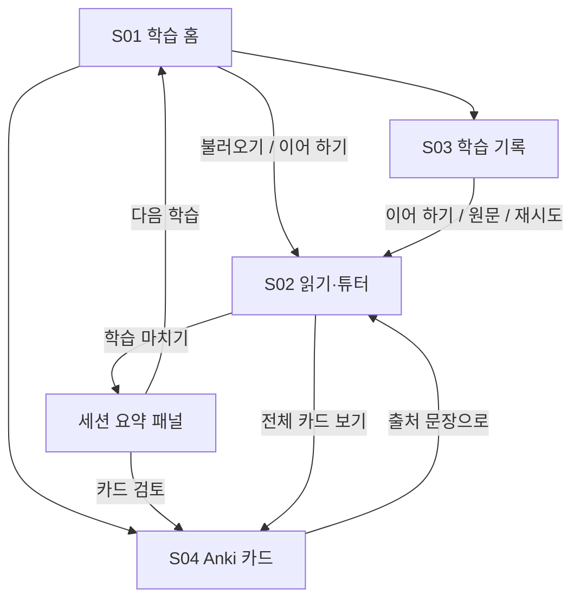

# 개인 AI 영어 학습 웹앱 PRD

- 문서 버전: 1.0
- 작성일: 2026-09-23
- 대상: 개인 학습자, UX 설계자, Codex 개발 담당
- 범위: 첫 번째 버전(MVP)의 제품 요구사항 및 인수 기준
- 상태: 개발 착수용 제안 명세. 아래 기본값으로 구현하고, 범위 변경은 별도로 기록한다.

## 1. 제품의 목적

Simple English Wikipedia에서 읽은 내용을 **스스로 추측하고, 설명을 확인하고, 다시 떠올리고, 영어로 사용한 뒤 Anki로 복습**하는 개인 학습 앱을 만든다.

현재는 읽기 자료, ChatGPT 질문, 학습 메모, Anki 카드가 분리되어 있다. 그 결과 질문 당시의 문맥과 자신의 오해를 다시 찾기 어렵고, 설명을 이해한 것을 실제로 기억하는 것과 혼동하기 쉽다. 이 앱은 질문 하나를 원문·추측·설명·확인 문제·복습 카드에 연결한다.

첫 버전의 성공은 기능 수가 아니라 **실제 글 하나로 학습부터 카드 내보내기까지 끊김 없이 완료하는 것**이다. 장기 복습 일정과 기억도 관리는 Anki에 맡긴다.

## 2. 대상 사용자와 기본 가정

### 2.1 주요 사용자

- 영어 글을 읽을 수 있지만 단어, 문장 구조, 문법 때문에 자주 멈추는 한국어 사용자.
- ChatGPT 설명과 Anki를 이미 활용하는 개인 학습자.
- 관심 주제로 학습하고 싶으며, 별도 자료 정리 시간을 줄이고 싶은 사용자.

### 2.2 MVP의 기본 결정

| 항목 | 결정 |
| --- | --- |
| 사용 범위 | 사용자 1명, 하나의 주 브라우저에서 사용 |
| 우선 환경 | 데스크톱 Chrome/Edge, 태블릿 터치 사용 지원 |
| 언어 | UI·설명은 한국어, 원문·예문·영작은 영어 |
| 학습량 | 1회 15~25분, 표현 1~3개를 권장하되 강제하지 않음 |
| 글 표시 | 원문의 제목·소제목·본문 문단 중심 읽기 모드 |
| 저장 | 동일 브라우저의 IndexedDB에 자동 저장 |
| AI 연결 | 서버 측 AI API 호출. 공급자·모델은 구현 시 선택 |
| 운영 | 로컬 실행 또는 소유자만 접근 가능한 배포 환경 |
| 장기 복습 | Anki로 UTF-8 TSV 내보내기 |

브라우저 저장은 새로고침·브라우저 재시작 후 유지되어야 한다. 다른 기기와 자동 동기화되지는 않으며, 브라우저 데이터 삭제 시 기록이 사라질 수 있다. 이 제약은 첫 사용 안내와 학습 기록 화면에 짧게 표시한다. TSV는 카드 내보내기이며 전체 기록 백업은 아니다.

원격 공개 서비스, 다중 사용자 계정 및 클라우드 동기화는 이 버전의 가정에 포함하지 않는다. 배포 환경이 소유자 접근 제한을 제공하지 않으면 우선 로컬에서 사용한다.

## 3. 범위와 우선순위

### 3.1 반드시 구현할 기능 — P0

| ID | 기능 | 사용자에게 제공하는 가치 |
| --- | --- | --- |
| F01 | 제목 또는 URL로 글 불러오기 | 공부할 글을 빠르게 선택 |
| F02 | 원문의 단어·문장 선택 및 질문 작성 | 문맥을 잃지 않고 질문 |
| F03 | 추측 먼저 입력 → AI 설명 확인 | 자신의 이해와 설명을 비교 |
| F04 | 회상 문제 및 짧은 영작 | 설명을 닫고 기억·사용 여부 확인 |
| F05 | 질문·답변·오답·학습 기록 자동 저장 및 다시 보기 | 중단 지점과 어려웠던 내용을 복원 |
| F06 | 카드 초안 편집 및 UTF-8 TSV 내보내기 | Anki 복습으로 연결 |
| F07 | 오류 복구·가독성·기본 운영 보호 | 실제로 지속 사용 가능한 최소 품질 확보 |

### 3.2 다음 버전 — P1

| 기능 | MVP에서 미루는 이유 | 확장 전에 확인할 사항 |
| --- | --- | --- |
| Breaking News English 듣기 | 음원·스크립트·재생 제어가 별도 흐름을 필요로 함 | 콘텐츠 이용 조건과 안정적인 불러오기 방식 |
| 문장 반복 재생·속도 조절·받아쓰기 | Reading 흐름 검증 후 추가 | 음원과 문장 구간의 대응 |
| 전체 기록 JSON 백업·복원 | 첫 버전은 한 브라우저에서 핵심 흐름 검증 | 데이터 버전 및 복원 충돌 정책 |
| 로그인·기기 간 동기화 | 계정·서버 데이터 관리 부담 | 실제로 여러 기기 사용이 필요한지 |
| AI 영작 피드백 | 자유 답안 판정의 품질 검증이 필요 | 복수 정답과 수정 이유를 설명할 수 있는지 |
| 오답 기반 새 문제 생성 | 같은 문제 재시도부터 검증 | 잘못 생성된 문제를 복습에서 제외하는 정책 |

### 3.3 이후 검토 — P2 / MVP 제외

- AnkiConnect 직접 전송, Anki 복습 이력 수집 및 양방향 동기화.
- 앱 자체의 간격 반복 알고리즘, 복습 알림, 스트릭·포인트·랭킹.
- 자동 수준 진단, CEFR 점수 산출, 개인화 추천 엔진.
- 문서 전체 번역, 자동 단어 일괄 추출, 글마다 대량 카드 생성.
- 자유 주제 무제한 챗봇, 외부 검색을 결합한 범용 AI 에이전트.
- 음성 대화, 발음 평가, 녹음, 이미지·음성 첨부 카드.
- PDF·유튜브·임의 웹사이트 가져오기, 브라우저 확장, 네이티브 앱.
- 결제, 구독, 소셜 공유, 팀 학습, 관리자 대시보드.

**범위 원칙:** 위 기능이 없어도 F01~F06을 완수할 수 있으면 MVP에 추가하지 않는다. 제품 내부 메뉴에 동작하지 않는 ‘준비 중’ 기능도 만들지 않는다.

## 4. 학습 경험 원칙

1. **읽기가 중심이다.** 질문을 마치면 이전 문단으로 돌아온다.
2. **설명보다 추측이 먼저다.** 틀릴 부담을 낮추되, 처음부터 답을 노출하지 않는다.
3. **설명은 짧고 문맥에 맞게 제공한다.** 한 질문에 핵심 설명, 쉬운 예문, 혼동 포인트를 제시한다.
4. **‘봤음’과 ‘기억함’을 구분한다.** 문제의 답을 보기 전 사용자 응답을 저장한다.
5. **‘사용함’을 한 번 경험한다.** 학습한 표현으로 자기 상황의 영어 문장 1개를 써 본다.
6. **카드는 사용자가 선택한다.** 질문했다고 모두 Anki 카드로 만들지 않는다.
7. **완료를 과장하지 않는다.** 문제 자기평가, 영작 시도, 파일 내보내기를 숙달이나 Anki 등록 완료로 표시하지 않는다.

## 5. 전체 학습 과정

아래 문장은 동작 설명을 위한 창작 예시이며 실제 Wikipedia 인용문이 아니다.

| 단계 | 사용자의 행동 | 앱의 반응 | 남는 기록 |
| --- | --- | --- | --- |
| 1. 시작 | 홈에서 `Bird` 등 관심 있는 제목 또는 URL 입력 | 정확한 제목을 조회하고, 없으면 후보 최대 5개 제시 | 불러온 글 스냅샷 |
| 2. 읽기 | 소제목과 문단을 읽고 모르는 문장에서 멈춤 | 원문을 읽기 모드로 표시하고 마지막 문단 기억 | 읽기 위치 |
| 3. 선택 | 예: `Birds are able to find food in winter.`의 `are able to` 선택 | 선택 표현과 포함 문단을 질문 패널에 고정 | 선택 위치·원문 문맥 |
| 4. 질문·추측 | ‘뜻·해석’ 선택 후 “~할 수 있다라는 뜻 같다” 입력 | 입력을 저장하고 `설명 확인` 활성화 | 질문 유형·질문·추측 |
| 5. 설명 | `설명 확인` 클릭 | 한국어 설명, 추측에 대한 피드백, 쉬운 영어 예문 표시 | AI 설명·생성 상태 |
| 6. 회상 | `기억 확인` 클릭 후 새 문장의 빈칸 답 입력 | 기존 설명을 접고 문제만 표시 | 제출한 답 |
| 7. 비교 | `예시 답 확인` 후 ‘맞았어요/부분적으로/틀렸어요’ 선택 | 예시 답·해설과 내 답을 나란히 표시 | 첫 시도 자기평가 |
| 8. 사용 | 학습 표현으로 “I am able to read this article.”처럼 자기 문장 작성 | 저장 후 선택적으로 AI 예시와 비교 | 사용자 영작·자기평가 |
| 9. 카드 | 기억할 표현에 `카드 만들기` 클릭 | 카드 앞·뒤 초안 표시, 사용자가 편집·확정 | 검토한 카드 |
| 10. 마무리 | `이번 학습 마치기` 클릭 | 질문·확인·영작·카드 수를 사실대로 표시 | 학습 세션 종료 시각 |
| 11. 내보내기 | 확정 카드 선택 후 TSV 다운로드 | 가져오기 설정 안내 | 내보내기 이력 |
| 12. 다음 학습 | 기록에서 오답 또는 진행 중 세션 선택 | 당시 원문과 답안을 복원, 답을 숨긴 재시도 제공 | 새로운 시도 기록 |

질문 하나마다 3~7단계를 반복할 수 있다. 짧은 영작은 세션에서 최소 한 번 권장하지만, 건너뛰어도 읽기나 세션 종료를 막지 않는다. 건너뛴 활동은 ‘미실시’로 남긴다.

### 5.1 중단과 재개

- 사용자는 어느 단계에서든 홈으로 이동할 수 있다. 입력 중인 초안과 현재 단계는 자동 저장한다.
- `이어 하기`는 기존의 진행 중 세션을 연다. 완료한 세션에서는 `다시 학습`으로 새 세션을 만든다.
- 세션 완료는 사용자가 `이번 학습 마치기`를 누른 상태다. 글 전체를 읽었거나 모든 문제를 맞혔다는 뜻이 아니다.
- 미풀이 문제나 미확정 카드가 있어도 종료할 수 있으며, 요약에서 남은 항목 수를 표시한다.

## 6. 화면과 이동 구조

### 6.1 화면 목록

전역 메뉴는 **학습 홈 / 학습 기록 / Anki 카드**의 세 가지다. 읽기 화면에서 대부분의 학습을 수행한다.

| 화면 ID | 화면 / 경로 예시 | 주요 구성 | 핵심 행동 |
| --- | --- | --- | --- |
| S01 | 학습 홈 `/` | 제목·URL 입력, 후보 목록, 가장 최근 진행 중 세션 | 글 불러오기, 이어 하기 |
| S02 | 읽기·튜터 `/learn/:sessionId` | 원문, 소제목 이동, 글자 크기, 질문 패널, 저장 상태 | 선택, 추측, 설명, 문제, 영작, 카드 초안 |
| S03 | 학습 기록 `/history` | 날짜순 세션, 글 제목 검색, ‘확인 필요만’ 필터, 세션 상세 | 이어 하기, 원문으로 이동, 재시도 |
| S04 | Anki 카드 `/cards` | 초안·확정 카드, 편집기, 앞·뒤 미리보기, 선택 내보내기 | 검토·확정, 제외·삭제, TSV 다운로드 |

세션 요약은 S02의 종료 패널, 기록 상세는 S03의 펼침 영역, 카드 편집은 S02/S04에서 재사용하는 패널이다. 별도 대시보드·퀴즈 페이지·채팅 페이지를 만들지 않는다.

### 6.2 화면 간 이동

전역 메뉴와 브라우저 뒤로 가기를 모두 지원한다. 왕복 이동 시 세션 ID, 읽기 문단, 질문 패널 상태를 유지한다. 다른 글의 카드를 열었다가 돌아와도 이전 학습 위치를 잃지 않는다.

### 6.3 읽기 화면의 구성

- 넓은 화면: 원문을 주 영역에, 튜터를 보조 영역에 표시한다. 질문하지 않을 때는 튜터를 접을 수 있다.
- 좁은 화면·태블릿: 원문과 튜터를 전환하는 한 열 구성. 튜터 상단에 선택 문장과 `원문으로`를 항상 제공한다.
- 원문 기본 글자 크기는 20px, 조절 범위는 18~26px, 줄 간격은 약 1.7로 한다.
- 본문 드래그·터치 선택 후 `질문하기`를 제공한다. 정밀 선택이 어려우면 문단 옆 `이 문단에서 질문`을 눌러 인용 범위를 줄일 수 있다.
- 버튼은 충분한 터치 영역을 확보하며, 정답·오답을 색상만으로 구분하지 않는다.
- 튜터 단계 표시는 `내 추측 → 설명 → 기억 확인 → 직접 쓰기`로 한다. 현재 단계에서 필요한 행동만 강조한다.

### 6.4 주요 화면의 빈 상태

| 상황 | 안내 및 행동 |
| --- | --- |
| 처음 방문 | “읽고 싶은 Simple English Wikipedia 제목이나 URL을 입력하세요.” |
| 학습 기록 없음 | “첫 글을 읽고 질문하면 기록이 여기에 쌓여요.” + 학습 시작 |
| 카드 없음 | “설명에서 기억하고 싶은 표현을 카드로 만들어 보세요.” |
| 확정 카드 없음 | 초안 검토로 이동, 빈 파일 다운로드는 비활성화 |
| AI 연결 미설정 | 읽기·기록·기존 카드 기능은 사용 가능, AI 기능에 연결 필요 표시 |

## 7. 기능별 상세 요구사항 및 완료 조건

아래 체크박스는 개발자가 검증할 인수 기준이다. 단순 화면 구현이나 모의 응답만으로 ‘완료’ 처리하지 않는다.

### F01. 글 불러오기와 출처

**요구사항**

- 제목 또는 `https://simple.wikipedia.org/wiki/...` URL을 하나의 입력창에서 받는다. 모바일 호스트 `simple.m.wikipedia.org`는 같은 문서의 표준 호스트로 정규화한다.
- URL은 지원 호스트·문서 경로만 허용하고, fragment는 읽기 위치 힌트로만 사용한다. 다른 사이트 URL을 임의로 요청하지 않는다.
- 제목 정확 일치를 우선하고, 없으면 제목 검색 후보를 최대 5개 보여 준다. 자동으로 엉뚱한 글을 선택하지 않는다.
- 리다이렉트는 최종 글 제목으로 표시한다. 동음이의어 문서는 후보를 선택하도록 한다.
- 본문의 제목·소제목·문단·일반 목록을 표시한다. 이미지, 표, 인포박스, 각주 목록, 탐색 템플릿, 수식 렌더링은 MVP에서 제외한다. 읽기 모드의 생략 범위와 원문 링크를 표시한다.
- 본문을 AI로 요약·재작성하지 않는다. 본문 추출이 실패하면 빈 글이나 생성한 글로 대체하지 않는다.
- 가져온 시점의 본문과 메타데이터를 스냅샷으로 저장한다. 이전 기록을 열 때 최신 원문으로 자동 교체하지 않는다.
- 제목, 표준 출처 URL, 원문 기여자/편집 이력 링크, 라이선스 이름·링크, 가져온 시각을 제공한다. revision ID를 확보하면 영구 링크도 저장한다.
- Wikipedia 원문과 앱/AI가 작성한 설명을 구분한다. 원문을 카드에 인용하면 해당 카드에도 출처·라이선스를 포함한다. 변형한 원문에는 변경 사실과 적용 조건을 표시한다. [R1]
- 일반 텍스트는 CC BY-SA 4.0 조건을 기준으로 처리하되 문서별 예외·추가 저작자 표시를 보존한다. 원문을 변형해 재배포하는 부분에도 동일조건변경허락을 적용한다. 라이선스를 확인할 수 없는 자료는 가져오기 성공으로 처리하지 않는다. [R1]
- 처리 상한은 정제한 본문 100,000자다. 초과 시 조용히 잘라내지 않고 더 짧은 글 선택을 안내한다.

**완료 조건**

- [ ] AC01-1: 유효한 제목과 해당 URL로 같은 문서를 열 수 있고, 본문이 첫 문단에만 한정되지 않는다.
- [ ] AC01-2: 없는 제목, 잘못된 URL, 동음이의어, 리다이렉트를 각각 구분해 처리한다.
- [ ] AC01-3: 출처·라이선스·기여 이력 링크가 읽기 화면에서 접근 가능하다.
- [ ] AC01-4: 새로고침 후 동일한 스냅샷과 읽기 위치를 복원한다.
- [ ] AC01-5: 로딩·본문 없음·상한 초과·네트워크 실패에 각각 이해할 수 있는 안내와 다음 행동이 있다.
- [ ] AC01-6: 공식 API로 가져온 HTML에 스크립트·이벤트 속성·위험한 URL이 있어도 실행되지 않는다.

### F02. 선택과 질문

**요구사항**

- 단어, 표현, 한 문장 또는 짧은 연속 문장을 선택할 수 있다. 선택 상한은 1,200자다.
- 질문 패널을 열 때 선택 텍스트·문단 ID·문자 위치를 고정해, 입력 중 브라우저 선택이 풀려도 유지한다.
- 질문 유형은 `뜻·해석 / 문장 구조·문법 / 표현·예문 / 직접 질문` 네 가지다.
- 앞의 세 유형은 기본 질문을 채워 주며 수정할 수 있다. 직접 질문은 질문 문장을 입력해야 한다.
- AI에는 선택 부분과 포함 문단을 보낸다. 필요한 인접 문단을 포함하되 문맥 총량은 6,000자로 제한한다. 글 전체·다른 세션 기록은 보내지 않는다.
- 질문과 추측 입력은 각각 1,000자로 제한한다. 문맥이 부족한 경우 AI가 부족함을 설명하도록 한다.
- 같은 표현을 다시 선택하면 기존 질문을 열거나 새 질문을 만들 수 있다. 같은 요청 버튼의 중복 클릭으로 새 항목을 만들지는 않는다.

**완료 조건**

- [ ] AC02-1: 마우스 선택과 태블릿 터치 선택으로 질문 패널을 열 수 있다.
- [ ] AC02-2: 선택이 해제되거나 패널에 포커스가 이동해도 인용 문구와 문맥이 유지된다.
- [ ] AC02-3: 빈 선택·상한 초과·비어 있는 직접 질문은 전송 전에 구체적으로 안내한다.
- [ ] AC02-4: 저장한 질문에서 원래 문단으로 돌아가 해당 구간을 표시한다.
- [ ] AC02-5: 문단 버튼을 통한 대체 선택 경로가 키보드와 터치로 동작한다.

### F03. 추측 후 AI 설명

**요구사항**

- 설명을 요청하기 전에 `내 생각에는…` 입력란을 제공한다. 한국어·영어 모두 허용한다.
- 비어 있으면 설명 요청을 막는다. 전혀 모르겠을 때는 `아직 모르겠어요`를 명시적으로 선택할 수 있으며 이것도 학습 응답으로 저장한다.
- 최초 제출한 추측은 이후 수정으로 덮어쓰지 않는다. 미제출 초안만 자유롭게 수정한다.
- `설명 확인`을 누른 뒤에만 AI를 호출한다. 입력하거나 단어를 선택하는 것만으로 호출하지 않는다.
- 설명 구성은 ① 문맥 속 뜻·자연스러운 해석 ② 질문에 맞는 핵심 설명 ③ 내 추측에서 맞은 부분과 수정할 부분 ④ 쉬운 예문 1~2개와 해석이다.
- 설명은 한국어 중심이며, 일반적으로 한 화면에서 핵심을 읽을 수 있는 분량으로 제한한다. 학습과 무관한 장황한 지식 설명은 하지 않는다.
- 문법 설명에서 원문에 없는 규칙을 단정하거나, 부정확한 사용자 추측에 무조건 동의하지 않는다. 문맥상 여러 해석이 가능하면 그 사실을 표시한다.
- AI 생성 내용임을 표시하고 `설명에 오류가 있어요`로 검토 필요 표시를 남길 수 있다. MVP에서 무제한 후속 채팅과 자동 재생성은 제공하지 않는다.
- 오류 표시를 한 설명에 연결된 새 카드 생성은 보류한다. 기존 연결 카드는 초안으로 돌려 재검토를 요구한다.

**완료 조건**

- [ ] AC03-1: 추측 또는 ‘아직 모르겠어요’를 제출하기 전에는 설명이 노출되지 않고 AI 요청도 발생하지 않는다.
- [ ] AC03-2: AI 요청에 원문 선택, 문맥, 질문 유형, 질문, 사용자 추측이 연결되어 전달된다.
- [ ] AC03-3: 응답의 필수 항목을 검증한 뒤 화면과 저장소에 반영한다. 불완전한 응답은 성공으로 취급하지 않는다.
- [ ] AC03-4: 실패해도 질문·추측을 유지하고 재시도할 수 있다. 성공한 답을 다시 열 때는 API를 재호출하지 않는다.
- [ ] AC03-5: 검토 필요 표시와 카드 보류 상태가 새로고침 후에도 유지된다.

### F04. 기억 확인과 직접 쓰기

**요구사항**

- 설명마다 `기억 확인`을 누르면 해당 학습 포인트의 짧은 주관식 문제 1개를 생성한다. 유형은 문맥 속 뜻 회상, 문법 이유 설명, 새 예문의 빈칸 중 하나다.
- 생성 결과는 질문·예시 답·핵심 해설을 포함한다. 예시 답과 해설은 답 제출 전 UI에 표시하지 않는다.
- 문제 풀이 중 AI 설명은 기본 접힘 상태다. 사용자가 다시 보면 해당 시도를 `설명 참고`로 기록한다.
- 사용자는 답을 작성하거나 `모르겠어요`를 제출한 후 예시 답을 확인한다.
- MVP는 **자기평가**를 사용한다. `맞았어요 / 부분적으로 맞았어요 / 틀렸어요` 중 하나를 선택한다. 문자열 일치나 AI 판정을 객관적 정답으로 사용하지 않는다.
- `부분적으로 맞았어요`, `틀렸어요`, `모르겠어요`는 ‘확인 필요’ 목록에 포함한다. 첫 시도 결과는 보존하고 재시도는 별도 기록으로 추가한다.
- 잘못되거나 모호한 문제에는 `문제 오류` 표시를 할 수 있다. 이 문제는 확인 필요·정답률 집계에서 제외하고, 이유를 메모할 수 있다.
- `직접 쓰기`는 현재 배운 표현/문법으로 자기 상황의 영어 한 문장을 쓰는 활동이다. 500자 이내의 자유 답안을 저장한다.
- 제출 후 예시와 비교하고 `사용해 봤어요 / 아직 어려워요`를 선택한다. 이는 문법 정확성 판정이 아니다. ‘아직 어려워요’는 기록에서 확인 필요로 표시한다.
- 직접 쓰기는 기존 설명의 예문을 재사용하므로 별도 AI 요청을 만들지 않는다. 건너뛰기를 허용한다.

**완료 조건**

- [ ] AC04-1: 유효한 설명에서 학습 포인트와 관련된 문제 1개를 만들고 저장한다.
- [ ] AC04-2: 제출 전 예시 답·해설은 화면과 접근성 트리에 노출되지 않는다. 제출 후 내 답과 함께 표시한다.
- [ ] AC04-3: 채점 방식이 자기평가임을 표시하고, 부분 정답·모름·미풀이를 정확히 구분한다.
- [ ] AC04-4: 오답을 재시도해도 첫 시도·각 후속 시도·설명 참고 여부가 남는다.
- [ ] AC04-5: 영작 입력·건너뛰기·자기평가 상태를 기록하고 다시 열 수 있다.
- [ ] AC04-6: 문제 오류 표시를 하면 집계에서 제외되며, 원래 문제와 답안은 삭제되지 않는다.

### F05. 저장과 학습 기록

**요구사항**

- 자동 저장 대상은 원문 스냅샷, 읽기 위치, 질문 초안, 제출한 추측, AI 설명, 문제·답안·자기평가, 영작, 카드, 세션 및 내보내기 이력이다.
- 입력 중에는 500ms 이내 디바운스로 저장한다. 단계 이동·제출·앱 내부 페이지 이동 시에는 저장 완료 후 이동한다.
- `저장 중 / 저장됨 / 저장 실패` 상태를 표시한다. 저장 실패를 성공으로 보이게 하지 않는다.
- 기록은 최신 세션 순으로 제공하고 글 제목 검색과 `확인 필요만` 필터를 제공한다. 복잡한 태그 체계·전문 검색은 제외한다.
- 기록 상세는 `원문 → 질문 → 내 추측 → 설명 → 문제와 시도 → 영작 → 연결 카드` 순서로 읽을 수 있다.
- 원문 위치를 찾지 못하면 저장된 인용과 문단을 보여 준다. 다른 문장을 잘못 강조하지 않는다.
- 카드 삭제는 해당 카드만 제거한다. 세션 삭제 시에는 포함 질문·문제·답안·영작·카드가 함께 삭제됨을 개수와 함께 확인한다.
- 다른 세션이 사용하는 원문 스냅샷은 세션 하나를 삭제해도 유지한다. 앱의 삭제는 이미 내보낸 TSV나 Anki 내용에 영향을 주지 않는다.

**완료 조건**

- [ ] AC05-1: 질문 초안, 설명 확인 후, 답 제출 후의 각 지점에서 새로고침해도 동일한 단계와 데이터를 복원한다.
- [ ] AC05-2: 브라우저를 닫았다 다시 열어도 저장된 세션과 기록을 조회할 수 있다.
- [ ] AC05-3: 제목 검색·확인 필요 필터가 저장된 기록과 일치한다.
- [ ] AC05-4: 저장 공간 부족 또는 저장소 사용 불가 시 입력을 화면에 유지하고 실패를 명확히 알린다.
- [ ] AC05-5: 세션 삭제의 취소는 아무 데이터도 바꾸지 않는다. 확인 시 명시한 대상만 삭제한다.
- [ ] AC05-6: 동일 브라우저 저장의 범위와 데이터 삭제 시 한계를 첫 사용과 기록 화면에서 확인할 수 있다.

### F06. Anki 카드 작성 및 UTF-8 TSV 내보내기

**카드 생성과 검토**

- 설명에서 `카드 만들기`를 누르면 선택 표현·원문·이미 생성된 설명/예문으로 초안을 채운다. 카드 생성 때문에 추가 AI 호출을 하지 않는다.
- 한 카드에는 한 가지 회상 목표만 둔다. 문법 설명 전체를 그대로 뒷면에 붙이지 않는다.
- 기본 방향은 `영어 → 한국어 뜻·설명`이다. `한국어 단서 → 영어 표현`은 사용자가 명시적으로 선택할 수 있다. 양방향 카드를 자동 생성하지 않는다.
- 두 방향 모두 같은 기본 앞·뒤 노트 구조를 사용한다. 빈칸 노트 유형 및 전용 템플릿 설치는 제외한다.
- 영어 앞면에는 원문 문장을 함께 보여 문맥을 보존하고 동형 표현을 구분한다. 뒤에는 뜻·핵심 설명·짧은 예문·출처를 넣는다.
- 앞·뒤 모두 편집 가능하며 공백만 있는 값은 확정할 수 없다. 출처 및 라이선스는 별도 읽기 전용 메타데이터에서 내보내기에 자동 첨부한다.
- 상태는 `초안 / 확정`이다. 수정한 확정 카드는 초안으로 돌아간다. 내보내기 이력은 별도 속성으로 유지한다.
- 동일 선택 문맥·표현·방향에 기존 카드가 있으면 새로 만들기 전에 기존 카드를 제시한다.

**내보내기 계약**

| 항목 | 규격 |
| --- | --- |
| 파일명 | `english-cards-YYYYMMDD-HHmmss.tsv` |
| 인코딩 | UTF-8, BOM 없음 |
| 문자 정규화 | Unicode NFC |
| 데이터 열 | `Front`, `Back`, `Tags` 순서의 정확히 3열 |
| 구분자 | 실제 탭 문자 1개 |
| 레코드 | 데이터 한 행이 노트 1개; 행 구분은 LF |
| 파일 헤더 | `#separator:Tab`, `#html:true`, `#tags column:3`를 각각 한 줄로 기록 |
| 일반 제목 행 | `Front/Back/Tags`를 데이터 행으로 넣지 않음 |
| 텍스트 처리 | 입력 텍스트의 HTML 특수문자를 escape한 후, 내부 줄바꿈을 ` `로 변환 |
| 필드 내부 탭 | 공백으로 치환하여 열 개수 고정 |
| 따옴표 | 각 필드를 큰따옴표로 감싸고 내부 큰따옴표는 두 번 기록하는 TSV quoting 적용 |
| 태그 | `ai_english`, `reading`, `recognition` 또는 `production`을 공백으로 연결 |
| 출처 | Back 끝에 원문 제목·URL, 기여 이력 URL, 라이선스·링크, 인용/변형 여부 포함 |

Anki는 UTF-8 구분 텍스트 가져오기, 필드 매핑, HTML 표시와 위 헤더를 지원한다. 앱은 해당 형식에 맞춰 내보내고, 최초 가져오기 때 앞·뒤·태그와 카드 수를 미리보기로 확인하도록 안내한다. [R2]

내보내기 대상은 선택한 **확정 카드**다. 기본 필터는 ‘확정 이후 현재 내용으로 아직 내보내지 않은 카드’이며, 과거 내보낸 카드도 다시 선택할 수 있다. 다운로드를 시작한 시각과 카드 버전을 기록하되 **Anki 등록 완료**로 표시하지 않는다. 브라우저에서 실제 저장을 취소했을 수 있으므로 다시 다운로드할 수 있어야 한다.

Anki 가져오기 안내는 ① 파일 가져오기 ② 기본 앞·뒤 노트 유형 선택(역방향 자동 생성 유형 제외) ③ 1열 Front·2열 Back·3열 Tags 확인 ④ 탭·HTML 설정 확인 ⑤ 사용자가 덱 선택 ⑥ 미리보기 후 가져오기 순서다. 노트 유형 이름이나 덱 이름은 파일에서 강제하지 않는다.

같은 파일을 다시 가져오면 Anki의 중복 처리 설정에 따라 기존 노트를 업데이트하거나 무시할 수 있다. 앞면을 바꾸면 새 노트로 인식될 수 있으므로 앱은 완전한 중복 방지나 양방향 동기화를 보장하지 않는다. [R2]

**완료 조건**

- [ ] AC06-1: 설명에서 초안을 만들고 앞·뒤 수정, 방향 선택, 미리보기, 확정, 삭제를 할 수 있다.
- [ ] AC06-2: 기본 영어 앞면 카드 하나가 역방향 카드까지 자동 생성되지 않는다.
- [ ] AC06-3: 초안·빈 앞면·빈 뒷면·검토 보류 카드는 내보내기에 포함되지 않는다.
- [ ] AC06-4: 파일이 UTF-8로 엄격하게 디코딩되고, 모든 데이터 행을 TSV parser로 읽었을 때 정확히 3열이다.
- [ ] AC06-5: 한글, 영어, 아포스트로피, 큰따옴표, 탭, 줄바꿈, `<`, `>`, `&`, 이모지가 포함된 카드의 내용을 Anki 가져오기 후 확인한다.
- [ ] AC06-6: 선택한 카드 수와 가져온 기본 카드 수가 일치하며, 첫 카드 앞면에 헤더나 BOM 문자가 나타나지 않는다.
- [ ] AC06-7: 내보낸 카드에도 출처·라이선스가 남고, 내보내기 이력이 실제 Anki 학습 상태로 표현되지 않는다.
- [ ] AC06-8: Anki Desktop에서 실제 가져오기 검증을 수행하고 사용한 버전·설정·결과를 남긴다. 환경이 없으면 이 기준은 ‘미검증’으로 보고한다.

### F07. 오류 복구와 운영 품질

| 상황 | 기대 동작 |
| --- | --- |
| 글 불러오기 실패 | 입력 유지, 구체적 안내, 수동 재시도 |
| AI 시간 초과·한도 초과 | 추측 유지, 요청 실패 표시, 연결/한도 확인 안내 |
| AI 응답 형식 오류 | 성공으로 저장하지 않음, 수동 재시도 |
| 저장 실패 | ‘저장됨’ 표시 금지, 입력 유지, 진행 전 복구 안내 |
| 카드 다운로드 실패 | 선택 유지, 다시 다운로드 |
| 앱 업데이트 후 데이터 구조 불일치 | 기록을 조용히 초기화하지 않음, 복구 가능한 오류 표시 |

- AI 키는 서버 환경 변수에만 둔다. 브라우저 저장소, 번들, 클라이언트 오류 메시지에 포함하지 않는다.
- AI 요청은 사용자 클릭으로만 시작하고, 요청 중 버튼을 잠근다. 자동 무한 재시도는 하지 않는다.
- 초기 운영 기본값은 설명·문제 생성을 합쳐 하루 50회 요청이며 서버 설정으로 변경한다. 재시도도 요청 횟수에 포함하고 거절 시 입력은 보존한다. 이는 비용 금액 상한을 보장하지 않는다.
- 요청 상한·입력 길이·출력 길이는 서버에서도 검증한다. 소유자 전용 접근 제한은 페이지뿐 아니라 AI API 경로에도 적용한다.
- 외부 원문은 학습 자료로만 취급한다. 글에 포함된 명령을 AI의 시스템 지침으로 실행하지 않는다.
- 외부 HTML 및 AI 결과를 안전하게 표시한다. AI에 실행 도구·임의 URL 접속 권한을 제공하지 않는다.
- 최초 AI 사용 시 선택 문장·문맥·질문·추측이 AI 처리 서비스로 전송된다는 안내를 제공한다. 서버 로그에 원문 답안이나 키를 불필요하게 남기지 않는다.
- 읽기와 저장된 기록 조회는 AI 장애와 무관하게 동작해야 한다. 완전한 오프라인 앱은 범위 밖이다.

**완료 조건**

- [ ] AC07-1: AI 키가 브라우저 번들·네트워크 응답·브라우저 저장소에서 발견되지 않는다.
- [ ] AC07-2: 소유자 제한 환경에서는 인증되지 않은 AI 요청이 거절된다. 로컬 전용 환경은 외부 공개 없이 동작한다.
- [ ] AC07-3: 연속 클릭·한도 초과·네트워크 실패에서도 질문과 카드가 의도치 않게 중복 생성되지 않는다.
- [ ] AC07-4: AI 오류 중에도 기존 원문·설명·기록·카드 편집을 사용할 수 있다.
- [ ] AC07-5: 1366×768 데스크톱, 768px 태블릿, 390px 좁은 화면에서 핵심 버튼과 입력이 잘리지 않는다.
- [ ] AC07-6: 키보드로 주요 입력·단계 이동·카드 확정·다운로드를 수행할 수 있고 포커스가 보인다.
- [ ] AC07-7: 저장된 데이터 스키마 버전을 명시하며, 버전 변경 시 사용자 기록을 무단 초기화하지 않는다.

## 8. 최소 데이터 모델

구현 프레임워크나 DB 라이브러리는 고정하지 않는다. 아래 연결과 상태 의미는 유지한다.

| 엔터티 | 필수 데이터 | 관계 |
| --- | --- | --- |
| ArticleSnapshot | id, 제목, pageId, revisionId(확보 시), 출처 URL, 이력 URL, 라이선스, 가져온 시각, 정제 본문, 문단 ID | 여러 세션에서 재사용 가능 |
| StudySession | id, articleSnapshotId, 시작·수정·종료 시각, 진행 중/완료, 마지막 문단, 활성 질문 ID | 여러 질문 포함 |
| LearningItem | id, sessionId, 인용, 문단·문자 위치, 문맥, 질문 유형·본문, 추측 초안·제출본, 단계, AI 설명·오류 표시 | 문제·영작·카드의 연결 기준 |
| RecallQuestion | id, learningItemId, 문제, 예시 답, 해설, 생성 상태, 문제 오류 여부 | 여러 시도 포함 |
| RecallAttempt | id, questionId, 답안, 모름 여부, 자기평가, 설명 참고 여부, 제출 시각 | 기존 시도를 덮어쓰지 않음 |
| ProductionAttempt | id, learningItemId, 내 영어 문장, 사용해 봄/어려움/건너뜀, 시각 | 정답 여부로 취급하지 않음 |
| Card | id, learningItemId, 방향, front, back, 출처 메타데이터, tags, 초안/확정, contentVersion | 수정 시 재확정 필요 |
| ExportBatch | id, 시각, 파일명, cardId·contentVersion 목록 | 파일 내보내기 이력만 의미 |

공통 ID는 앱 내부에서 안정적으로 유지한다. 원문 위치는 저장된 본문 기준으로 계산한다. 저장소에 `schemaVersion`을 두며 AI 실패 상태와 사용자 학습 데이터를 분리한다.

상태 전이의 핵심은 `추측 작성 → 설명 요청 중 → 설명 저장 → 문제 응답 → 자기평가 저장`이다. 요청 실패는 사용자 입력이 남아 있는 직전 단계로 돌아간다. 직접 쓰기·카드 만들기·세션 마치기는 설명 저장 이후 선택할 수 있다.

## 9. 기술 경계와 외부 의존성

### 9.1 역할 분리

- 클라이언트: 읽기 UI, 선택 위치, 학습 상태, IndexedDB 저장, 카드 편집, TSV 생성.
- 서버: 허용된 Wikipedia API 요청, AI 호출, 입력·응답 검증, 요청 상한, 비밀키 관리.
- Wikipedia: 글 및 출처 메타데이터 공급.
- AI: 선택한 문맥의 설명과 확인 문제 생성.
- Anki: 내보낸 카드의 장기 복습. 앱이 Anki 내부 상태를 추정하지 않는다.

### 9.2 구현 지침

- Wikipedia는 공식 MediaWiki API를 사용한다. 본문 가져오기는 `action=parse` 등 공식 파싱 경로를 후보로 삼고, 실제 Simple English Wikipedia 문서로 검증한다. [R3]
- 요약만 주는 응답을 전체 본문으로 취급하지 않는다. TextExtracts를 기본 경로로 고정하지 않는다. 공식 문서에 유지관리 및 출력상 주의점이 있으므로 본문 추출 성공률을 먼저 확인한다. [R4]
- AI 요청/응답을 UI와 분리된 어댑터로 둔다. 설명과 문제 응답에 명확한 필드 계약을 두고 검증한다. 공급자를 바꾸어도 저장 기록을 읽을 수 있어야 한다.
- 특정 개발 서비스나 호스팅 업체를 제품의 필수 조건으로 두지 않는다. 실행 가능한 최소 구성을 고르고, 실제 외부 연결이 없는 데모 상태는 명확히 표시한다.
- 구현 시 사용하는 API·모델·패키지의 현재 지원 여부는 다시 확인한다. 이 PRD는 특정 버전이나 호출 가격을 보장하지 않는다.

## 10. 개발 순서와 출시 판단

### 10.1 Codex 작업 단위

| 순서 | 구현 범위 | 검증 산출물 |
| --- | --- | --- |
| 1 | F01 + S01/S02, 본문 스냅샷 저장 | 제목·URL 불러오기와 출처 표시 |
| 2 | F02/F03, 질문 패널과 AI 연결 | 추측 전 호출 금지·실제 설명 저장 |
| 3 | F04, 회상 문제와 영작 | 답 숨김·자기평가·재시도 기록 |
| 4 | F05 + S03, 중단·재개와 기록 조회 | 새로고침·재시작 복원 |
| 5 | F06 + S04, 카드·TSV | 특수문자 검증·Anki 실제 가져오기 |
| 6 | F07 및 전체 흐름 점검 | 오류 복구·접근 제한·반응형 확인 |

각 작업은 해당 AC 번호를 보고하고 `완료 / 미완료 / 미검증`을 구분한다. 후속 버전 기능을 임의로 추가하지 않는다. 실제 외부 연결·Anki 테스트가 막히면 완료로 바꾸지 말고 남은 검증과 원인을 기록한다.

### 10.2 출시 전 필수 시나리오

1. 제목으로 글 불러오기 → 문장 선택 → 추측 → 실제 AI 설명 → 문제 풀이 → 자기평가 → 영작 → 카드 확정 → TSV → Anki에서 확인.
2. URL로 같은 글을 열고 원문 출처와 전체 읽기 모드가 맞는지 확인.
3. 틀린 답을 남긴 후 앱을 종료하고 다시 열어 기록에서 재시도. 첫 오답 보존 확인.
4. AI 요청 실패·한도 초과 상태에서 입력을 보존하고 수동 재시도.
5. 한글·특수문자·내부 줄바꿈이 있는 카드 여러 개를 가져와 앞·뒤·출처 확인.
6. 키보드와 태블릿 터치로 선택부터 설명 확인까지 수행.

P0의 AC가 모두 완료되고 위 시나리오를 통과해야 MVP 완료다. 화면 데모, 다운로드 버튼 동작, 테스트용 AI 고정 응답만으로 출시 완료를 선언하지 않는다.

### 10.3 출시 후 1주간 관찰할 지표

분석 서비스는 붙이지 않고 저장된 세션에서 계산하거나 사용자가 직접 점검한다. 아래 수치는 학습 효과의 확정된 기준이 아니라 초기 제품 검증 목표다.

| 관찰 항목 | 초기 목표 또는 판단 |
| --- | --- |
| 전체 흐름 완수 | 실제 학습 5회 중 4회 이상 카드 내보내기까지 막힘 없이 진행 |
| 추측 단계 준수 | 모든 설명 요청에 추측 또는 ‘아직 모르겠어요’가 존재 |
| 회상 활동 | 세션마다 최소 한 번 답을 보기 전에 응답했는지 확인 |
| 직접 사용 | 완료 세션에서 영어 문장 1개 이상 쓰기를 얼마나 수행했는지 관찰 |
| 내보내기 신뢰성 | 인코딩 오류·필드 분리 오류 0건 |
| 저장 신뢰성 | 정상 종료·새로고침으로 인한 기록 유실 0건 |
| 학습 부담 | 질문 하나를 처리하는 단계가 과하면 우선 버튼·입력을 줄여 개선 |

자기평가 정답률과 영작 시도 수는 실제 영어 실력 점수가 아니다. Anki 기억도는 동기화하지 않으므로 앱에서 장기 기억 향상을 측정했다고 표현하지 않는다.

## 11. 개발 착수 시 사용할 지시문

> 이 PRD.md를 기준으로 개인 영어 학습 웹앱 MVP를 개발해 줘. 먼저 문서의 P0 범위, 화면 4개, 브라우저 저장 방식, 외부 API 연결 가능 여부를 확인하고 최소 기술 구성을 정해 줘. F01부터 개발 순서대로 구현하되 각 단계에서 실제 동작을 검증하고 대응하는 AC 번호를 보고해 줘. 후속 버전 기능이나 회원가입·결제·자체 복습 알고리즘을 추가하지 마. 추측 전 AI 설명 노출 금지, 기록 복원, 원문 출처, UTF-8 TSV 및 Anki 기본 카드 가져오기는 필수다. 모의 응답과 실제 연결을 명확히 구분하고, 검증하지 못한 항목은 미검증으로 남겨 줘.

## 12. 외부 규격 참고 자료

확인일: 2026-09-23. 아래 자료는 콘텐츠 재사용 및 연동 형식의 근거이며, UX·학습량·저장 방식 등은 이 문서의 제품 설계 결정이다.

- **[R1]** [Wikimedia Foundation Terms of Use — Licensing of Content](https://foundation.wikimedia.org/wiki/Policy:Terms_of_Use#7._Licensing_of_Content)
- **[R2]** [Anki Manual — Text Files](https://docs.ankiweb.net/importing/text-files.html)
- **[R3]** [MediaWiki API — Parsing wikitext](https://www.mediawiki.org/wiki/API:Parsing_wikitext)
- **[R4]** [MediaWiki — TextExtracts](https://www.mediawiki.org/wiki/Extension:TextExtracts)
