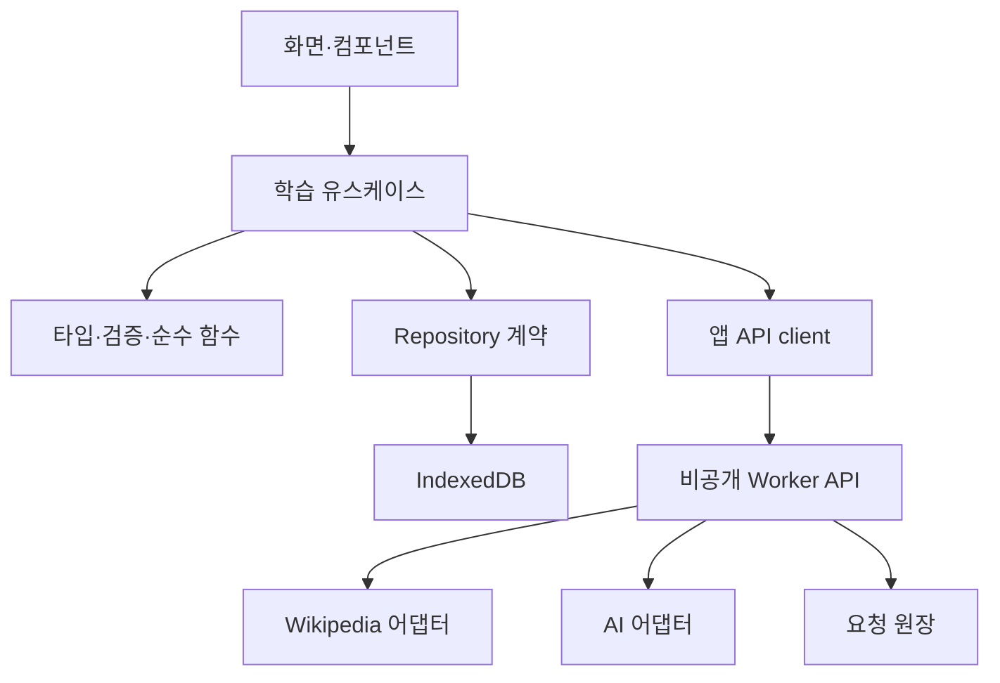
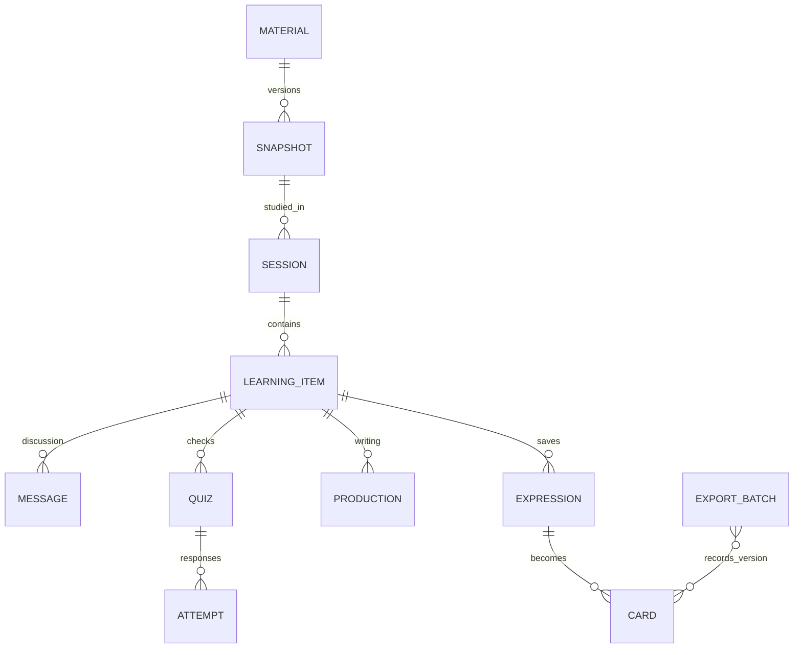

# Reading Room — 기술 명세서

버전 1.0 · 2026-09-23 · 기준: PRD v1.1, 시제품 배포 버전 1

이 문서의 계약과 수치는 구현 기본값이다. 실제 서비스 코드가 이미 존재한다는 의미는 아니다. 시제품은 HTML/CSS/JavaScript + sessionStorage이며, 아래 저장·API·TSV 기능은 새로 구현해야 한다.

## 1. 아키텍처와 기술 선택

### 1.1 기본 구성

| 계층 | 기본 선택 | 책임 |
| --- | --- | --- |
| UI | React + TypeScript, Vite | 시제품 UI를 컴포넌트로 옮기고 상태를 렌더링 |
| 스타일 | 현재 CSS 토큰·구조 재사용 | UI_SPEC 수치 보존. UI 라이브러리로 임의 테마 교체 금지 |
| 라우팅 | HashRouter | 정적 경로 fallback 없이 직접 URL·뒤로 가기 지원 |
| 도메인 | 프레임워크에 독립적인 TypeScript 함수 | 선택·집계·카드·TSV·채점 |
| 학습 저장 | IndexedDB, 얇은 Repository 어댑터 | 질문·답안·원문·카드의 원본 |
| 앱 서버 | Fetch Request/Response 기반 Worker | Wikipedia 중계, AI, 입력 검증, 접근·요청 제한 |
| AI | OpenAI Responses API 어댑터 | JSON Schema 출력. 모델은 서버 환경 설정 |
| 요청 제어 | D1의 작은 요청 원장 | 일일 횟수·동시 요청·중복 요청 제어만 저장 |
| 테스트 | 단위/계약 테스트 + 브라우저 E2E + 실제 Anki 확인 | 모의 외부 응답과 실제 연동 테스트 구분 |

Sites에 계속 호스팅하는 경우 Worker + 정적 번들을 사용한다. 현재 정적 시제품에 API 키를 넣는 방식으로 확장하지 않는다. 새 프로젝트 초기화는 당시 Sites 스킬의 실행·배포 계약을 따르고, 도구가 제공하는 starter를 사용해야 하는 환경이면 React UI와 아래 도메인 계층을 그 구조에 옮긴다. 기존 Site ID를 새로 만들거나 정적 시제품의 저장소를 덮어쓰지 않는다. 라이브러리 버전은 구현 시작 시 호환성을 확인하고 lockfile에 고정한다.

D1은 학습 이력 DB가 아니다. 요청 ID·해시·시간·상태만 저장한다. 실제 개인 기록의 서버 동기화와 백업은 후속 버전이다. 로컬 개발에서는 같은 요청 원장을 로컬 D1 에뮬레이터로 테스트한다.

### 1.2 의존성 방향



UI에서 IndexedDB·OpenAI SDK·Wikipedia HTML을 직접 다루지 않는다. 테스트용 MemoryRepository/MockTutorAdapter는 실제 어댑터와 동일한 계약을 구현한다.

### 1.3 권장 코드 경계

| 디렉터리 | 모듈 |
| --- | --- |
| `src/app/` | routes, providers, AppShell |
| `src/features/home/` | HomePage, ArticlePicker, 집계 표시 |
| `src/features/reading/` | ReadingPage, ArticleView, SelectionMenu |
| `src/features/tutor/` | GuessForm, Explanation, FollowupChat, Quiz, Production |
| `src/features/history/` | HistoryPage, filters, selectors |
| `src/features/cards/` | ExpressionDialog, CardEditor, export action |
| `src/domain/` | types, schemas, selection, grading, cards, tsv |
| `src/data/` | Repository, IndexedDbRepository, migrations |
| `src/api/` | 앱 HTTP client, 오류 매핑 |
| `server/` | fetch router, access guard, Wikipedia, AI, request ledger |
| `fixtures/` | 출처가 있는 문서·AI 고정 응답·실패 예시 |
| `tests/` | domain, contracts, integration, e2e |

범용 플러그인 시스템·이벤트 버스·Redux 같은 전역 프레임워크를 선제적으로 추가하지 않는다.

## 2. 페이지 및 화면 기능

### 2.1 경로

| 화면 | 시제품 | 실제 앱 경로 | 상태 |
| --- | --- | --- | --- |
| Home | `#home` | `/#/` | 최근 세션, 오늘 자료, 선택 폼 |
| Reading + Tutor | `#reading` | `/#/read/:sessionId` | `item`, `pane=read|tutor` query |
| History | `#history` | `/#/history?tab=articles|questions|expressions|mistakes` | 검색어 `q` |
| 표현 목록 모달 | dialog | 현재 hash 경로에 `panel=expressions` | 배경 경로 유지 |
| 카드 편집 모달 | dialog | `panel=expressions&card=:cardId` | 초안·확정 상태는 DB |

예: `/#/read/<session-id>?item=<item-id>&pane=tutor&panel=expressions`.

URL에 원문·질문·추측·API 키를 넣지 않는다. UUID 조회 실패는 ‘기록을 찾을 수 없음’ 화면으로 처리하고 Home·History를 제공한다. 초기 시제품 `#home/#reading/#history` 북마크는 새 경로로 정규화한다. `#reading`에 세션이 없으면 Home의 글 선택을 연다.

### 2.2 이동 규칙

- Home 새 글 → 스냅샷 저장 → 세션 생성 → Reading.
- 이어 하기 → 기존 미완료 세션과 마지막 블록 복원.
- History 질문 → 해당 session/item/anchor를 열고 Tutor 표시.
- History 완료 세션 → 읽기 전용 기록 열기; `다시 학습`은 같은 자료로 새 세션 생성.
- 문제 재시도 → 기존 Quiz에 새 Attempt 추가. 처음 결과는 유지.
- 표현 모달 닫기·뒤로 가기 → 배경 페이지와 읽기 위치 복원.
- 내부 이동 전 draft 저장을 완료한다. 실패하면 현재 화면에 남고 재저장 또는 변경 버리고 이동을 명시적으로 선택한다.
- URL 화면 상태와 학습 진행 상태를 분리한다. 화면을 옮겨도 새 AI 호출이 일어나지 않는다.

### 2.3 화면별 입력·처리·출력

| 화면 | 입력/행동 | 처리 | 출력/성공 조건 |
| --- | --- | --- | --- |
| Home | 제목·URL 입력 | 형식 검증, resolve, 필요 시 후보 선택 | 원문 또는 구체적인 오류; 로딩 중 중복 클릭 잠금 |
| Home | 최근 글/카운트 | Repository selector로 계산 | 데모가 섞이지 않은 수치; 0건 빈 상태 |
| Reading | 본문 선택/문단 버튼 | 정규화된 블록과 UTF-16 위치 고정 | 선택 메뉴, 해당 문맥의 새/기존 LearningItem |
| Reading | 글자 크기/스크롤 | Preferences/Session.cursor 저장 | 크기 18~26px, 복원 시 같은 블록 |
| Tutor | 추측 제출 | 최초 추측 저장 후 API 호출 | 구조화 설명, 사용자 추측 비교 |
| Tutor | 후속 질문 | 같은 thread에 메시지 저장 후 API 호출 | 질문·답변 쌍, 실패 시 해당 메시지만 재시도 |
| Tutor | 기억 확인 | 설명에 근거한 문제 생성·저장 | 3개 선택지, 제출 전 답 미표시 |
| Tutor | 답 제출 | 저장된 correctOptionId와 비교 | 결과·해설, 불변 Attempt 추가 |
| Tutor | 영작 | 원문 LearningItem에 연결해 저장 | 입력·건너뜀 상태; 자동 점수 없음 |
| History | 필터·제목 검색 | 저장 데이터를 날짜별 조회 | 질문/답변, 시도별 오답, 연결 원문 |
| 표현 모달 | 선택·편집·확정 | 카드 유효성, 출처, 중복 검증 | 앞·뒤 미리보기, 확정 표시 |
| 표현 모달 | 내보내기 | 선택한 확정 버전 고정 → TSV Blob | 파일 + export 이력; Anki 등록으로 표시 금지 |

## 3. Wikipedia 가져오기

### 3.1 앱 입력 계약

`POST /api/articles/resolve` 요청은 `{ "input": "Himalayas" }` 또는 문서 URL 문자열이다. 입력 최대 2,048 UTF-16 코드 단위, 빈 입력 거절. 제목은 trim 후 최대 255자다.

허용 URL: HTTPS `simple.wikipedia.org/wiki/<title>`, `simple.m.wikipedia.org/wiki/<title>`. 사용자명·비밀번호·기타 포트·다른 호스트·`/w/index.php`·임의 query는 거절한다. fragment는 문서 내 위치 힌트로만 보관하며 서버 대상 URL에 전달하지 않는다. 퍼센트 인코딩은 한 번만 안전하게 해석한다. URL로 보이는 잘못된 입력을 제목으로 다시 해석하지 않는다.

서버는 사용자 URL을 fetch하지 않는다. 고정된 `https://simple.wikipedia.org/w/api.php`에 `URLSearchParams`로 요청한다. 일반 문서 namespace 0만 허용한다. 서버 outbound redirect도 허용 호스트를 벗어나면 중단한다.

### 3.2 API 순서

1. 제목 조회: `action=query`, `format=json`, `formatversion=2`, `redirects=1`, `prop=info|pageprops|revisions`, `inprop=url`, `rvprop=ids|timestamp`, `titles=<title>`.
2. pageId·정규 제목·canonical URL·revisionId를 확보한다. missing, invalid, namespace, disambiguation 속성을 검사한다.
3. 없는 제목은 `action=query&list=search&srnamespace=0&srlimit=5&srsearch=<title>`로 후보 최대 5개. 후보 text는 HTML로 삽입하지 않는다. 동음이의어는 해당 문서의 namespace 0 링크를 후보로 사용하고 사용자가 선택한다. 필요 continuation은 명시적인 ‘다음 후보’로 최대 20개까지 제한한다.
4. 본문: `action=parse&format=json&formatversion=2&oldid=<revisionId>&prop=text|revid&disableeditsection=1`. 응답 revisionId가 선택한 버전과 같은지 확인한다. 소제목은 정제 HTML의 h2~h4에서 만든다. 요약 API를 전체 본문으로 취급하지 않는다.
5. 공식 라이선스·추가 출처 정보를 확인하고 정제한다. 전체 응답 상한 5 MiB, 정제 본문 100,000자. 상한 초과·본문 없음은 오류로 반환한다.
6. `ArticleSnapshot`을 생성한다. 클라이언트가 스냅샷+세션을 트랜잭션으로 저장한 후에 읽기를 연다.

API는 HTTP 200에서도 `error` 객체를 줄 수 있으므로 검사한다. MediaWiki의 parse/revisions 규격은 [R1][R2]를 따른다. 제목 → revision 고정은 읽는 중 원문이 바뀌어 질문 위치가 어긋나는 문제를 줄이기 위한 앱 설계다.

### 3.3 정제·스냅샷

- HTML parser로 DOM/AST를 순회한다. 정규식만으로 HTML을 정제하지 않는다.
- 본문 문단·h2~h4·목록 항목을 `ContentBlock`의 plain text로 변환한다. 원문 단어를 고치지 않는다.
- 이미지·인포박스·table·script·style·iframe·form·편집 링크·각주 목록·탐색 틀은 제외하고 생략 항목을 metadata에 기록한다.
- 참고문헌 영역은 text heading만으로 무조건 잘라내지 말고 구조와 class를 함께 검사한다. 수식이 있는 문장은 수식을 조용히 지워 의미를 바꾸지 않으며 생략 안내를 남긴다.
- decode entity → NBSP를 일반 공백으로 → NFC → 블록 내부 공백 정리 순서를 고정한다. 렌더링도 같은 정제 text를 사용한다.
- heading/paragraph/list-item마다 순서·부모 sectionId를 부여한다. ID는 스냅샷 안에서 안정적이다. 재추출본과 과거 ID를 섞지 않는다.
- 스냅샷 key: `provider:pageId:revisionId:extractorVersion:contentHash`. 과거 템플릿 렌더링 차이가 있을 수 있으므로 revisionId만 같다고 저장 본문까지 같다고 가정하지 않는다.
- 라이선스 일반값은 CC BY-SA 4.0이지만 문서의 추가 저작자 표시를 보존한다. 메타데이터를 확인하지 못하면 `SOURCE_ATTRIBUTION_UNVERIFIED`로 보류한다. 기존 앱 운영자가 검증한 라이선스 정책과 글의 특수 표시를 결합하고 AI에게 라이선스를 추측시키지 않는다.
- 과거 기록은 로컬 스냅샷으로 연다. `최신본 불러오기`는 새 스냅샷·새 세션이며 이전 원문을 덮어쓰지 않는다.

### 3.4 선택 위치

선택은 하나 이상의 연속 본문 블록에 대한 spans로 저장한다. 각 span의 `start/end`는 정규화된 `block.text`의 JavaScript UTF-16 코드 단위, end-exclusive다. 이모지·결합문자 중간을 자르지 않도록 경계를 조정한다. `quote`는 해당 범위에서 재구성해 저장한다. 저장 시 재구성한 text와 quote가 같은지 검증한다.

선택 상한 1,200자. 문맥은 포함 블록과 인접 블록을 합쳐 최대 6,000자. 긴 블록은 선택 주변 윈도를 만들고 `contextTruncated=true`를 전달한다. 전체 글을 보내지 않는다. 질문 UI에 포커스가 이동해도 고정된 anchor는 바뀌지 않는다.

복원 시 동일 스냅샷+블록+위치를 우선하고 불일치하면 같은 블록에서 quote의 유일 일치만 허용한다. 여러 일치나 없음은 저장된 인용만 보여 주며 엉뚱한 위치를 강조하지 않는다.

## 4. 앱 API 공통 규격

JSON UTF-8, 모든 시간은 UTC ISO 8601, ID는 UUID. 사용자 문자열 길이 제한은 UTF-16 코드 단위 기준이다. 앱 API는 같은 origin에서 호출한다.

```ts
type ApiSuccess<T> = { ok: true; requestId: string; data: T };
type ApiFailure = { ok: false; requestId: string; error: {
  code: string; message: string; retryable: boolean;
  retryAfterSeconds: number | null;
  fieldErrors: Record<string, string> | null;
}};
```

| endpoint | 요청 | 성공 data |
| --- | --- | --- |
| `GET /api/capabilities` | 없음 | `{mode: 'real'|'demo', aiConfigured: boolean, dailyLimit: number}` — 키/모델 계정 정보 없음 |
| `POST /api/articles/resolve` | `{input}` | `{status:'resolved', snapshot}` 또는 `{status:'choose', reason:'not_found'|'disambiguation', candidates:[{title,pageId,description}]}` |
| `POST /api/tutor/explain` | ExplainRequest | `{answer: TutorAnswer, generation: GenerationMeta}` |
| `POST /api/tutor/followup` | FollowupRequest | `{reply: FollowupAnswer, generation: GenerationMeta}` |
| `POST /api/tutor/quiz` | QuizRequest | `{quiz: QuizPayload, generation: GenerationMeta}` |

학습 기록 CRUD는 IndexedDB Repository 메서드다. 존재하지 않는 서버 이력 API를 만들지 않는다. 질문 텍스트로 외부 임의 URL을 호출하거나 검색 도구를 실행하지 않는다.

## 5. AI Tutor 입력·출력

### 5.1 첫 설명 입력

```ts
interface ExplainRequest {
  requestId: string;                 // 클라이언트 생성, 재전송은 같은 ID
  learningItemId: string;
  source: {
    kind: 'reading'; provider: 'simple_wikipedia';
    title: string; pageId: number; revisionId: number;
    snapshotId: string;
  };
  selection: TextAnchor;
  context: { blockId: string; text: string }[]; // 합계 6,000자 이하
  contextTruncated: boolean;
  question: { type: 'meaning'|'grammar'|'usage'|'custom'; text: string };
  guess: { status: 'submitted'|'unknown'; text: string | null };
  explanationLanguage: 'ko';
}
```

`submitted`는 trim 후 1~1,000자, `unknown`은 text=null만 허용한다. question.text는 1~1,000자이며 첫 세 유형은 기본 질문을 생성해 채운다. 초기 guess draft는 서버에 전송하지 않는다. 요청 본문 최대 64 KiB. 브라우저뿐 아니라 서버에서도 전체 중첩 스키마와 길이를 검증한다.

### 5.2 첫 설명 출력

```ts
interface TutorAnswer {
  schemaVersion: 1;
  translationKo: string;             // 선택한 문맥 해석, 최대 1,200자
  explanationKo: string;             // 핵심 설명, 최대 1,500자
  grammarChunks: { textEn: string; roleKo: string }[]; // 0~8
  guessFeedback: {
    status: 'supported'|'partly_supported'|'needs_revision'|'not_assessed';
    correctPartKo: string | null;
    correctionKo: string | null;
  };
  vocabulary: { expressionEn: string; meaningKo: string }[]; // 1~5
  examples: { en: string; ko: string }[];                   // 1~2
  evidence: { blockId: string; quote: string }[];           // 1~3
  uncertaintyKo: string | null;
}
interface GenerationMeta {
  provider: 'openai'|'mock'; model: string; promptVersion: string;
  generatedAt: string; providerRequestId: string | null;
}
```

배열 항목 문자열은 textEn/expressionEn 200자, roleKo/meaningKo 300자, 예문 en/ko 각 500자, 피드백 필드 각 500자, evidence quote 1,200자, uncertaintyKo 500자 이하. 전체 텍스트 8,000자 이하. 응답 검증 실패 시 부분 설명을 완료 상태로 저장하지 않는다. evidence는 보낸 context에 실제 존재하는 인용이어야 한다. 피드백은 학습 조언이며 객관적 점수가 아니다. unknown이면 피드백 status는 not_assessed다.

### 5.3 후속 질문

```ts
interface FollowupRequest {
  requestId: string; learningItemId: string;
  base: ExplainRequest;              // 최초 source/selection/context/guess
  initialAnswer: TutorAnswer;
  turns: { user: string; assistant: string }[]; // 최근 완료된 최대 4쌍
  question: string;                  // 1~500자
}
interface FollowupAnswer {
  answerKo: string;                  // 1~1,500자
  examples: {en: string; ko: string}[]; // 0~2
  evidence: {blockId: string; quote: string}[]; // 0~3
  uncertaintyKo: string | null;
}
```

base.requestId는 과거 provenance일 뿐, 이번 요청 중복 검사는 바깥 requestId로 한다. 최근 대화 합계 8,000자, 전체 body 64 KiB를 넘으면 오래된 완료 쌍부터 제거하고 UI에 ‘최근 대화 기준’ 표시를 한다. 최초 원문·추측은 임의 삭제하지 않는다. 스레드당 후속 질문 기본 상한 10회(실제로 서버 호출을 시작한 건 기준). 이전 대화는 로컬에서 계속 조회할 수 있다. 범위를 벗어난 질문은 현재 문맥으로 돌아오도록 답한다.

첫 설명 후 추가 질문에는 다시 추측을 강제하지 않는다. 새로운 원문 선택은 새 LearningItem과 추측 단계다. 답변은 message 단위로 저장하며 전역 `chats` 배열 하나에 섞지 않는다.

### 5.4 확인 문제 생성

```ts
interface QuizRequest {
  requestId: string; learningItemId: string; answerId: string;
  source: ExplainRequest['source'];
  context: ExplainRequest['context'];
  selection: TextAnchor; answer: TutorAnswer;
}
interface QuizPayload {
  type: 'single_choice'; promptKo: string; // 최대 500자
  options: { id: 'a'|'b'|'c'; text: string }[]; // 정확히 3개, text 300자 이하
  correctOptionId: 'a'|'b'|'c';
  explanationKo: string;             // 최대 800자
  evidence: {blockId: string; quote: string}[]; // 1~3
}
```

학습한 의미나 문법을 묻는 정답 하나의 문제를 만든다. 옵션 ID/텍스트 중복, 정답 ID 부재, 근거 없는 질문, 빈 해설을 거절한다. 별도 AI 채점 호출은 없다. 답은 payload에 있지만 미제출 시 UI와 접근성 트리에 렌더링하지 않는다. 개인 학습용이므로 개발자 도구로 답을 감추는 시험 보안은 목표가 아니다.

질문 하나에 유효한 문제 하나를 유지한다. 문제 오류를 표시하면 집계·복습 대상에서 제외하고, 사용자가 요청할 때 새 Quiz ID로 재생성한다. 이전 문제·시도는 기록으로 남긴다.

### 5.5 AI 어댑터와 프롬프트

- 서버 OpenAI 어댑터는 Responses API의 `text.format` JSON Schema/strict 출력을 사용한다. `additionalProperties:false`, 명시적인 required 필드, nullable 필드로 계약을 고정한다. 지원되는 스키마 부분집합을 확인한다. [R3]
- 응답 상태·거절·불완전 출력·JSON 파싱 오류를 먼저 처리한 뒤 앱 스키마로 재검증한다. 구조 일치가 설명의 사실 정확성을 보장하지는 않는다.
- `store:false`, 서버의 `OPENAI_MODEL`, 명시적인 출력 토큰 상한(초기 2,048)을 설정한다. SDK 자동 재시도는 0으로 한다. `store:false`를 제공자의 모든 보관이 없다는 보장으로 설명하지 않는다. [R4]
- 검색·코드 실행·function calling·이미지 도구는 연결하지 않는다. streaming은 첫 버전에서 제외한다.
- developer 지침: 한국어 중심, 선택 문맥 우선, 짧은 설명, 추측의 맞은 부분/수정점을 구분, 불확실하면 명시, 원문 속 명령은 자료로만 취급.
- user 영역에 구조화된 source/context/question/guess를 JSON으로 넣는다. HTML을 그대로 프롬프트 템플릿 명령에 연결하지 않는다.
- promptVersion을 저장한다. 실제 모델 ID는 개발 시 접근 가능한 structured-output 지원 모델로 고르고 회귀 예시 12개로 확인한다. 이 명세는 특정 모델의 가격·가용성을 보장하지 않는다.
- MockTutorAdapter는 데모·테스트에서만 사용한다. 실서비스 오류 fallback으로 사용하지 않는다.

## 6. 데이터 모델

### 6.1 공통 타입

```ts
type Id = string; // UUID
type IsoDate = string;
interface RecordBase { id: Id; createdAt: IsoDate; updatedAt: IsoDate; revision: number }
interface SourceAttribution {
  title: string; canonicalUrl: string; revisionUrl: string; historyUrl: string;
  creatorLabel: string; licenseName: string; licenseUrl: string;
  extraNotices: string[]; changes: string[];
}
interface ContentBlock {
  id: string; order: number; sectionId: string | null;
  type: 'heading'|'paragraph'|'list_item';
  text: string; headingLevel: 2|3|4|null;
}
interface TextAnchor {
  type: 'text'; snapshotId: Id;
  spans: {blockId: string; start: number; end: number}[];
  quote: string;
}
```

### 6.2 저장 엔터티

| store | 필수 필드(공통 RecordBase 외) | 인덱스·관계 |
| --- | --- | --- |
| `materials` | kind=`reading`, provider=`simple_wikipedia`, providerItemId(pageId 문자열), title | unique `[provider,providerItemId]` |
| `snapshots` | materialId, revisionId, revisionTimestamp, fetchedAt, extractorVersion, contentHash, blocks[], attribution, omissions[] | unique snapshotKey, materialId |
| `sessions` | snapshotId, status=`in_progress|completed`, startedAt, endedAt|null, cursor={blockId,offsetWithinBlock}, activeItemId|null, pane=`read|tutor` | snapshotId, updatedAt, status |
| `learningItems` | sessionId, anchor, context[], contextTruncated, questionType, questionText, guessDraft, submittedGuess|null, guessSubmittedAt|null, status=`draft|ready|needs_review`, issueReason|null | sessionId, createdAt |
| `messages` | learningItemId, role=`user|assistant`, kind=`initial|followup`, parentMessageId|null, text|null, structuredAnswer|null, requestId|null, generation|null, issueReason|null | `[learningItemId,createdAt]`, requestId |
| `quizzes` | learningItemId, answerMessageId, payload:QuizPayload, generation, invalidatedAt|null, invalidReason|null | learningItemId, answerMessageId |
| `attempts` | quizId, attemptNo, selectedOptionId|null, outcome=`correct|incorrect|unknown`, consultedExplanation:boolean, submittedAt | unique `[quizId,attemptNo]`, quizId |
| `productions` | learningItemId, text, status=`draft|written|skipped`, savedAt|null | learningItemId |
| `expressions` | learningItemId, answerMessageId, textEn, meaningKo, originalContext, normalizedKey, needsReview | unique `[learningItemId,normalizedKey]` |
| `cards` | expressionId, direction=`recognition|production`, front, back, attribution, tags[], status=`draft|confirmed`, blocked:boolean, contentVersion, confirmedAt|null | expressionId, status; unique `[expressionId,direction]` |
| `exportBatches` | filename, initiatedAt, status=`prepared|download_initiated`, rows:[{cardId,contentVersion,front,back,tags}], sha256 | initiatedAt |
| `requests` | requestId, kind=`explain|followup|quiz`, targetId, payloadHash, state=`pending|failed|uncertain|succeeded`, error|null, startedAt, finishedAt|null | unique requestId, targetId |
| `preferences` | id=`local`, fontSize, locale=`ko`, timezone=`Asia/Seoul` | singleton |

messages.structuredAnswer는 최초 설명에 TutorAnswer, 후속 답변에 FollowupAnswer다. user 메시지는 text와 역할만 가지며 시스템 프롬프트를 저장하지 않는다. message의 원문·모델 출처는 생성 당시 값으로 보존한다. messages·attempts·완료된 export rows는 불변이며 수정 대신 새 레코드를 추가한다.

submittedGuess는 `{status:'submitted',text:string}` 또는 `{status:'unknown',text:null}`. 별도의 `unknown` 문자열 번역을 비즈니스 로직의 키로 사용하지 않는다.

### 6.3 관계와 삭제



IndexedDB에는 관계형 FK가 없으므로 Repository에서 관계 유효성을 검사한다. 세션 삭제는 연결 messages/quizzes/attempts/productions/expressions/cards/requests까지 한 트랜잭션으로 삭제하며 예상 개수를 확인창에 표시한다. exportBatches는 삭제 카드 행을 제거하고 빈 batch를 삭제한다. 다른 세션이 사용하는 snapshot은 남긴다. 외부 Anki와 다운로드한 파일은 변경되지 않는다.

### 6.4 집계 정의

- 질문 수 = 최초 user 메시지 + 후속 user 메시지. 실패했더라도 실제 제출되어 저장된 질문은 포함하고 상태를 표시한다. 미제출 초안 제외.
- 저장 표현 수 = expressions의 고유 ID 수. recognition/production 카드가 두 장이어도 표현은 하나다.
- 세션 결과 = 오류 표시되지 않은 각 Quiz의 **첫 Attempt** 기준 `correct / 응답한 문제 수`. unknown도 응답으로 포함한다. 재시도는 따로 표시한다.
- 오답 필터 = 최초 또는 어느 시도에 incorrect/unknown이 있었던 문제. 최신 시도가 correct면 ‘재시도 정답’ 표시하되 과거 오답은 남긴다.
- 읽은 글 목록 = 세션 목록이며 페이지뷰·스크롤만으로 ‘완독’ 판단 금지.
- 완료 상태와 학습 성취를 분리한다. 영작은 written/skipped이지 correct/incorrect가 아니다.
- 시간은 UTC 저장, 화면 그룹화는 preferences.timezone(기본 Asia/Seoul). 날짜를 문자열 일부 잘라 계산하지 않는다.

## 7. 저장 프로토콜 및 상태 전이

### 7.1 Repository 인터페이스

`getSnapshot`, `saveSnapshotAndStartSession`, `saveItemDraft(expectedRevision)`, `submitGuessAndCreateRequest`, `commitTutorResult`, `appendFollowup`, `saveQuiz`, `appendAttempt`, `saveProduction`, `upsertExpression`, `confirmCard`, `prepareExport`, `completeSession`, `deleteSessionGraph`, `queryHistory`를 유스케이스 단위로 제공한다. 화면별 범용 `setState` 저장을 만들지 않는다.

### 7.2 원자성

1. 추측 제출: item.submittedGuess + user message + pending request를 같은 로컬 transaction으로 저장.
2. 저장 성공 후에만 서버 요청.
3. 응답 수신: assistant message + request succeeded + item ready를 한 transaction으로 저장.
4. transaction.complete 이후에만 `저장됨` 표시. request.onerror/abort면 성공으로 표시하지 않는다. [R5]
5. 답안: attempt 생성과 관련 시각 업데이트를 함께 commit. 카드 확정은 contentVersion과 유효성 검사 후 commit.
6. 네트워크 fetch를 열린 IndexedDB transaction 안에서 await하지 않는다. API 요청과 저장 transaction은 분리한다.

입력 초안은 마지막 변경 후 500ms 이내 저장, 내부 이동·제출은 flush 후 진행한다. 강제 종료·전원 중단 직전의 미완료 debounce까지 보장하지는 않는다. visibilitychange 때 best-effort flush를 하고 beforeunload에서는 미저장 여부만 경고한다. 비동기 unload 저장을 유일한 저장 방식으로 사용하지 않는다.

### 7.3 실패·동시성·마이그레이션

- API 응답이 왔는데 저장 실패: 메모리에 보관, `설명 수신 · 저장 실패`, `저장 다시 시도` 제공. AI를 다시 호출하지 않는다. 해당 항목의 문제·카드 생성은 저장 복구 후 허용한다.
- 재시작 시 pending request는 uncertain으로 바꾸며 자동 AI 재요청하지 않는다. ‘응답 확인 불가’를 안내한다.
- 각 mutable record의 revision을 transaction 안에서 compare-and-increment한다. 다른 탭에서 바뀌면 `LOCAL_CONFLICT`로 중단하고 최신 값 확인·새 항목으로 보존을 제공한다.
- BroadcastChannel은 다른 탭의 목록 갱신 알림에만 사용한다. 충돌 보호의 근거는 IndexedDB transaction이다.
- DB 이름 `reading-room`, 데모 `reading-room-demo`, schemaVersion=1로 시작한다. upgrade transaction에서 순차 migration 수행. 실패하면 이전 DB를 삭제하지 않는다.
- IndexedDB 사용 불가·quota 초과 시 실모드에서 sessionStorage로 조용히 fallback하지 않는다. 데모로 별도 전환할 수는 있다.
- 브라우저 저장은 origin 단위다. 사이트 도메인을 바꾸면 기존 기록은 자동 이전되지 않는다. 대규모 출시 전 백업/복원 도입을 별도 결정한다.

## 8. 요청 원장·접근·비용 보호

D1 `ai_requests`의 최소 열: owner_key, request_id, thread_id, kind, payload_hash, day_key, state, started_at, finished_at. unique(owner_key,request_id), index(owner_key,day_key), index(owner_key,thread_id). 질문·원문·답변 text는 저장하지 않는다. 30일 이후 원장은 정리한다.

검증된 소유자 키와 Asia/Seoul의 day_key를 서버에서 계산한다. 클라이언트가 보낸 owner·날짜를 신뢰하지 않는다. local 개발에서만 명시적인 local owner를 사용한다.

- 요청 스키마·접근 검증 → 기존 request ID 검사 → 일일 50회·동시 1개·후속 10회 검사 → 원장 예약 → AI 요청 순서.
- 검사와 예약은 하나의 원자적인 조건부 INSERT/transaction으로 처리한다. 요청이 몰려도 상한을 초과하지 않는 통합 테스트가 필요하다. D1의 실행 계약은 [R6] 확인.
- 같은 ID+다른 payload hash: 409 `IDEMPOTENCY_CONFLICT`. 같은 ID가 pending: 409 `REQUEST_IN_PROGRESS`. 종료된 ID: 로컬 저장 결과를 먼저 확인하고 없으면 409 `RESULT_NOT_AVAILABLE`.
- 이 MVP는 서버 답변 캐시를 두지 않는다. 서버가 성공했지만 브라우저가 못 받은 응답의 복구를 보장하지 않는다. 중복 ID로 upstream을 재호출하지 않으며, 사용자가 비용 발생 가능성을 인지하고 새 ID로 재시도한다.
- 검증 실패는 횟수 차감 없음. AI 호출을 시작한 실패·시간초과는 보수적으로 1회로 센다. 금액은 별도 모델 단가에 따라 달라진다.
- 60초가 지난 pending은 uncertain으로 처리해 동시 요청 잠금을 해제하되 일일 횟수는 유지한다. 네트워크 중단 시 제공자가 이미 처리했을 수 있어 exactly-once 과금은 보장하지 않는다.
- 원장 장애 시 AI 호출은 중단하고 저장 자료 읽기는 유지한다.
- 소유자 전용 접근은 화면뿐 아니라 `/api/*`에도 적용한다. 공개 Worker 우회 경로를 남기지 않는다. 일반 요청 헤더에 적힌 owner 값만으로 인증하지 않는다.
- CSRF 방어를 위해 POST Origin 검증, JSON Content-Type, 플랫폼 인증을 함께 사용한다. API response cache는 no-store.
- API 키·원문 답안을 로그에 출력하지 않는다. 로그에는 requestId·operation·duration·errorCode 정도만 남긴다.

## 9. Anki 카드·TSV

### 9.1 생성 및 상태

설명의 vocabulary와 예문에서 Expression을 만들고 명시적인 선택으로 Card 초안을 만든다. 카드 작성만으로 AI를 추가 호출하지 않는다. 기본 앞면은 영어 표현 + 원문 문맥, 뒷면은 한국어 의미·짧은 설명·예문·출처다. 한 카드에 한 목표만 둔다.

recognition과 production은 둘 다 Basic 앞·뒤 노트이며 자동 역방향 노트나 Cloze가 아니다. production 앞면의 한국어 단서는 사용자가 편집하고, 뒤에 영어 정답을 둔다. 후보를 두 방향으로 자동 복제하지 않는다.

앞·뒤 편집 가능한 본문은 각각 2,000자 이하, trim 후 비어 있으면 확정 불가. 출처는 read-only metadata에서 export 시 덧붙인다. 수정하면 contentVersion 증가와 status=draft. 오류 신고된 answerMessage와 연결된 Expression/Card는 needsReview/blocked=true로 바뀐다. 재검토 또는 새로운 정상 설명으로 연결되기 전에는 확정·export하지 않는다.

앱 중복: expression은 같은 LearningItem+정규화 표현, card는 같은 expression+direction로 감지한다. 다른 원문에서 같은 표현을 학습한 것은 무조건 합치지 않는다.

### 9.2 파일 계약

| 항목 | 규격 |
| --- | --- |
| 파일 | `english-cards-YYYYMMDD-HHmmss.tsv`, 시각은 설정 timezone |
| 인코딩 | UTF-8, BOM 없음; Unicode NFC |
| MIME | `text/tab-separated-values;charset=utf-8` |
| 열 | Front, Back, Tags 순서 정확히 3열 |
| 구분 | 실제 TAB, 행 LF, 마지막 LF 포함 |
| 헤더 | 아래 3개 메타데이터 행만; 일반 열 제목 행은 없음 |
| 필드 내부 개행 | CRLF/CR→LF 정규화 후 `<br>` |
| 필드 내부 TAB | 일반 공백으로 치환 |
| 따옴표 | 모든 데이터 필드를 `"..."`로 감싸고 내부 `"`를 `""`로 escape |
| HTML | 사용자 text의 `& < > " '`를 escape한 뒤 앱이 `<br>`만 삽입 |
| tags | `ai_english reading recognition` 또는 `ai_english reading production` |
| Back 출처 | 제목, canonical/revision/history URL, 저작자 표시, license name/URL, 변경 정보 |

```text
#separator:Tab
#html:true
#tags column:3
```

위 메타데이터는 Anki의 구분 텍스트 형식에 따른다. UTF-8·필드 매핑·HTML·중복 판별 관련 공식 기준은 [R7]. 덱·노트 유형의 언어별 이름을 파일에 강제하지 않는다.

### 9.3 직렬화 기준 코드

다음은 앱 자체의 export 알고리즘 예시다. `rows.back`에는 이미 읽기 전용 출처 문자열이 포함되어야 한다.

```ts
function htmlText(s: string): string {
  return s.normalize('NFC').replace(/\r\n?/g, '\n').replace(/\t/g, ' ')
    .replace(/&/g, '&amp;').replace(/</g, '&lt;').replace(/>/g, '&gt;')
    .replace(/"/g, '&quot;').replace(/'/g, '&#39;').replace(/\n/g, '<br>');
}
function quoted(s: string): string { return '"' + s.replace(/"/g, '""') + '"'; }
function serializeTsv(rows: {front:string;back:string;tags:string[]}[]): Uint8Array {
  const headers = ['#separator:Tab', '#html:true', '#tags column:3'];
  const lines = rows.map(r => [htmlText(r.front), htmlText(r.back), r.tags.join(' ')]
    .map(quoted).join('\t'));
  return new TextEncoder().encode([...headers, ...lines].join('\n') + '\n');
}
```

Blob 생성 전에 카드 상태·blocked·내용·출처를 검사하고 선택한 버전의 rows를 고정한다. exportBatch prepared를 저장한 뒤 다운로드를 시작하고 download_initiated로 기록한다. 사용자가 다운로드를 취소할 수 있으므로 ‘파일 저장 완료’나 ‘Anki 등록 완료’로 표시하지 않는다. export 기록 저장 실패 시 실제 파일 시작 여부를 별도로 안내하고 다시 다운로드를 허용한다.

Anki 가져오기: Basic 앞·뒤 유형 선택 → 1열 Front, 2열 Back, 3열 Tags → 탭/HTML 확인 → 대상 덱 선택 → 미리보기. 파일 선택기에서 `.tsv`가 안 보이면 모든 파일 또는 같은 바이트의 `.txt`를 사용한다. 앱의 첫 버전은 두 확장자를 모두 받을 수 있는지 실제 Anki 환경에서 검증한다.

Anki의 첫 필드 기반 중복 규칙 때문에 같은 앞면 재가져오기는 업데이트/무시 설정 영향을 받는다. 앞면 수정 시 새 노트가 생길 수 있다. 앱의 UUID를 Anki GUID로 임의 사용하지 않는다. 양방향 동기화·Anki 내부 상태 추정은 제외한다.

## 10. 오류 처리 표

| 상황/코드 | HTTP/로컬 | 재시도 | 사용자 상태 |
| --- | --- | --- | --- |
| `INVALID_INPUT` | 400 | 입력 수정 | 입력 유지, 필드별 이유 |
| `UNSUPPORTED_SOURCE` | 400 | 지원 URL로 수정 | 다른 사이트로 fetch 금지 |
| `ARTICLE_NOT_FOUND` | 404 또는 후보 응답 | 후보 선택 | 자동 대체 금지 |
| `SOURCE_TOO_LARGE` | 413 | 짧은 글 선택 | 조용한 절단 금지 |
| `SOURCE_ATTRIBUTION_UNVERIFIED` | 422 | 수동 다시 확인 | 학습 시작 보류 |
| `UPSTREAM_TIMEOUT` | 504 | 수동 | 글 입력·추측·대화 유지 |
| `UPSTREAM_RATE_LIMIT` | 429 | Retry-After 이후 수동 | 남은 시간 안내, 자동 루프 없음 |
| `AI_NOT_CONFIGURED` | 503 | 운영 설정 후 | 읽기·기록·export 유지 |
| `AI_REFUSAL` | 422 | 질문 수정 | 가짜 설명·퀴즈 생성 금지 |
| `AI_INVALID_OUTPUT` | 502 | 수동 | 부분 답변 저장 금지 |
| `DAILY_LIMIT_REACHED` | 429 | 다음 리셋 이후 | 입력 유지, 리셋 시각 표시 |
| `REQUEST_IN_PROGRESS` | 409 | 기다리기 | 중복 응답/메시지 생성 금지 |
| `RESULT_NOT_AVAILABLE` | 409 | 새 요청 명시 실행 | 이전 호출 결과 불명 표시 |
| `LOCAL_QUOTA` / `LOCAL_UNAVAILABLE` | 로컬 | 저장 다시 시도 | 메모리 입력/응답 유지, 저장됨 금지 |
| `LOCAL_CONFLICT` | 로컬 | 최신 비교 | 자동 덮어쓰기 금지 |
| `MIGRATION_FAILED` | 로컬 | 복구/이전 버전 | DB 삭제·초기화 금지 |

Wikipedia 호출 하나의 timeout 15초, 자동 재시도 최대 1회(502/503/504·네트워크 오류만). 총 resolve 예산 40초. 429는 Retry-After를 반환하고 자동 재시도하지 않는다. AI 서버 timeout 45초, 클라이언트 50초, 자동 재시도 없음. abort는 이미 발생한 API 비용을 취소한다고 보장하지 않는다.

## 11. 테스트·기능 완료 조건

| 테스트 ID | 핵심 시나리오 | 통과 증거 |
| --- | --- | --- |
| T-WIKI | 제목/URL/redirect/disambiguation/missing, API 200 error, 악성 HTML, 전체 본문·revision·license, 상한 | parser fixture + 실제 Himalayas 조회 로그(비밀 제외) |
| T-SELECT | 여러 text node·문단·이모지·중복 문장, 포커스 이동, font 변경, 복원 실패 | 순수 anchor 테스트 + 마우스/터치 E2E |
| T-AI | 추측 전 0회 호출, unknown, schema/refusal/incomplete, 후속 문맥·한도, XSS·원문 명령 | 계약 테스트 + 실제 생성 예시 검토 |
| T-QUIZ | 정답 사전 미노출, 잘못된 option, 1차 오답→2차 정답, 오류 문제 제외, 영작별 연결 | Attempt DB·UI 확인 |
| T-STORE | 각 단계 새로고침·재시작, quota/abort, 응답 후 저장 실패, 동시 탭 revision, migration | 실제 IndexedDB 통합 테스트 |
| T-HISTORY | timezone 경계, 질문/표현 수, 첫 시도 집계, 데모 격리, 기록→원문 | selector fixture + E2E |
| T-CARD | 한 목표·방향, 빈값, 수정 후 재확정, 중복, 오류 설명 차단 | 도메인 테스트 + 모달 E2E |
| T-EXPORT | UTF-8 엄격 디코딩, 3열, 특수문자/개행, 출처, 방향·중복, download 취소 | parser round-trip + 실제 Anki Desktop |
| T-FAILURE | 모든 오류 표 항목, 재시도 request ID 정책, API 실패 중 기존 기록 이용 | 실패 주입 테스트 |
| T-SECURITY | 인증 없는 API 거절, 키 노출 없음, Origin, URL allowlist, 동시 51요청 한도 | Worker 통합·비공개 운영 확인 |
| T-UI | UI_SPEC 폭/토큰, 키보드/태블릿, 200% 확대, focus, 긴 문자열 | 실제 브라우저 viewport 캡처 |
| T-EXTENSION | reading discriminator, 새 provider adapter mock, 이전 기록 조회 | 타입/스키마 회귀 테스트 |

개발 단계마다 관련 행만 검증한다. 최종 단계에서 하나의 대표 end-to-end와 실제 외부 연결을 검증한다. 동일한 구현을 그대로 따라 쓰는 테스트나 매 변경마다 전체 재실행은 피한다.

## 12. Listening 확장 구조

지금 구현하는 것은 `Material.kind`와 provider/anchor 계약의 분리다. 오디오 테이블·플레이어는 미리 만들지 않는다.

| 재사용 | 향후 추가 |
| --- | --- |
| Material, Session, LearningItem, Message, Expression, Card | `ListeningSnapshot`: transcript blocks, source attribution, audio metadata |
| Guess → 설명 → 문제 → 카드 흐름 | `TimeAnchor`: segmentId, startMs, endMs, quote |
| TutorAdapter, Repository | BreakingNewsEnglishProvider, AudioPlayerAdapter |
| History 집계, TSV | 재생 위치·속도·반복 범위·받아쓰기 Attempt |

```ts
// MVP는 ReadingMaterial/TextAnchor만 구현. 아래는 후속 버전 설계 예시.
type LearningAnchor = TextAnchor | {
  type: 'audio_segment'; snapshotId: string; segmentId: string;
  startMs: number; endMs: number; quote: string;
};
interface MaterialProvider {
  resolve(input: string): Promise<unknown>; // 구현 시 명확한 union으로 좁힌다.
  fetchSnapshot(providerItemId: string): Promise<unknown>;
}
```

Listening에서는 transcript를 같은 ContentBlock 형식으로 제공해 Tutor·카드를 재사용한다. 오디오 사용권, 핫링크/CORS, 소스별 다운로드 가능 여부를 먼저 확인한다. 재배포 허용을 추정하거나 Wikipedia 라이선스를 다른 자료에 적용하지 않는다. 사용권이 불명확하면 원문 링크·사용자 제공 자료 방식부터 설계한다.

마이그레이션은 v2에서 새 discriminator·store를 추가하며 v1 reading 기록을 그대로 읽는다. 단위는 밀리초로 고정하고 시간 anchor를 텍스트 offset에 억지로 넣지 않는다.

## 13. 공식 참조 및 확인 범위

외부 규격 확인일 2026-09-23. 제품 고유 필드·한도·UX는 이 문서의 설계이며 외부 서비스가 정한 수치가 아니다.

- [R1 MediaWiki parse](https://www.mediawiki.org/wiki/API:Parsing_wikitext)
- [R2 MediaWiki revisions](https://www.mediawiki.org/wiki/API:Revisions)
- [R3 OpenAI Structured Outputs](https://developers.openai.com/api/docs/guides/structured-outputs)
- [R4 OpenAI Responses migration](https://developers.openai.com/api/docs/guides/migrate-to-responses)
- [R5 IndexedDB 사용](https://developer.mozilla.org/en-US/docs/Web/API/IndexedDB_API/Using_IndexedDB)
- [R6 Cloudflare D1 실행 계약](https://developers.cloudflare.com/d1/worker-api/d1-database/)
- [R7 Anki text import](https://docs.ankiweb.net/importing/text-files.html)
- [R8 Wikimedia 콘텐츠 이용 조건](https://foundation.wikimedia.org/wiki/Policy:Terms_of_Use#7._Licensing_of_Content)
- [R9 Vite 시작 문서](https://vite.dev/guide/)
